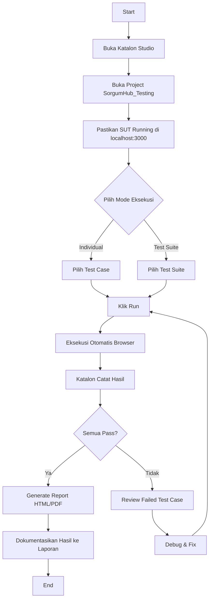

# Draft Pengujian Perangkat Lunak - SorgumHub

## Bab 4.x - Implementasi Pengujian Perangkat Lunak

---

## 1. Ruang Lingkup Pengujian

Pengujian dilakukan terhadap **semua fitur** yang tersedia pada sistem SorgumHub berdasarkan **3 role pengguna**:

| No | Role | Keterangan | Halaman yang Diuji |
|---|---|---|---|
| 1 | **User (Umum)** | Pengguna publik yang mengakses konten edukasi, chatbot AI, dan reward | Dashboard, Edukasi, AI Chatbot, Rewards, Redeem, Profile, Notifikasi |
| 2 | **Tim Marketing** (Anggota & Ketua) | Tim yang mengelola konten, perencanaan, dan program reward | Dashboard, Planner, Board, AI Generator, Assets, Education Management, Content History, Team, Rewards Management, Profile, Notifikasi |
| 3 | **Admin** | Administrator sistem yang mengelola user, pengaturan, dan monitoring | Dashboard (Statistik, User Management, Settings, Activity Logs), Profile, Notifikasi |

### Akun Test yang Dibutuhkan

| Email | Password | Role | Status |
|---|---|---|---|
| sorgumologyy@gmail.com | Sorgum1234@ | ADMIN | Active |
| user@test.com | User1234@ | USER | Active |
| marketing@test.com | Marketing1234@ | MARKETING | Active |
| ketuamkt@test.com | Ketua1234@ | KETUA_MARKETING | Active |
| marketing_pending@test.com | Test1234@ | MARKETING | Pending |

---

## 2. Perancangan Pengujian

Bab ini berisi deskripsi test case yang dirancang untuk menguji setiap fungsionalitas yang tersedia pada sistem SorgumHub. Test case yang dibuat mengimplementasikan pendekatan **Black Box Testing** dengan teknik **Equivalence Partitioning** dan **Boundary Value Analysis**.

---

### Tabel 2-1 Rancangan Pengujian Fungsionalitas Login (Semua Role)

| Fungsionalitas | ID Test Case | Deskripsi/Skenario | Pra Kondisi | Langkah Pengujian | Data Pengujian | Hasil yang Diharapkan |
|---|---|---|---|---|---|---|
| Login | TC-LGN-01 | Pengguna tidak mengisikan email dan password | Pengguna berada pada halaman login (`/#/login`) | 1. Buka halaman login<br>2. Klik tombol "MASUK SEKARANG" tanpa mengisi field apapun | email = (kosong)<br>password = (kosong) | Login gagal, browser menampilkan validasi HTML5 "Please fill out this field" |
| Login | TC-LGN-02 | Pengguna mengisikan email yang tidak terdaftar | Pengguna berada pada halaman login | 1. Buka halaman login<br>2. Isikan email yang tidak terdaftar<br>3. Isikan password<br>4. Klik tombol "MASUK SEKARANG" | email = tidakada@test.com<br>password = Test1234@ | Login gagal, muncul toast error "Email atau password salah" |
| Login | TC-LGN-03 | Pengguna mengisikan password yang salah | Pengguna berada pada halaman login | 1. Buka halaman login<br>2. Isikan email yang terdaftar<br>3. Isikan password yang salah<br>4. Klik tombol "MASUK SEKARANG" | email = sorgumologyy@gmail.com<br>password = passwordsalah | Login gagal, muncul toast error "Email atau password salah" |
| Login | TC-LGN-04 | Login berhasil sebagai ADMIN | Pengguna berada pada halaman login | 1. Buka halaman login<br>2. Isikan email admin<br>3. Isikan password admin<br>4. Klik tombol "MASUK SEKARANG" | email = sorgumologyy@gmail.com<br>password = Sorgum1234@ | Login berhasil, muncul toast "Selamat datang kembali", diarahkan ke halaman `/admin/dashboard` |
| Login | TC-LGN-05 | Login dengan akun berstatus PENDING | Pengguna berada pada halaman login, akun marketing berstatus PENDING | 1. Buka halaman login<br>2. Isikan email akun marketing pending<br>3. Isikan password<br>4. Klik tombol "MASUK SEKARANG" | email = marketing_pending@test.com<br>password = Test1234@ | Login gagal, diarahkan ke halaman `/pending-approval` |
| Login | TC-LGN-06 | Login berhasil sebagai USER | Pengguna berada pada halaman login | 1. Buka halaman login<br>2. Isikan email user<br>3. Isikan password user<br>4. Klik tombol "MASUK SEKARANG" | email = user@test.com<br>password = User1234@ | Login berhasil, diarahkan ke halaman `/user/dashboard` |
| Login | TC-LGN-07 | Login berhasil sebagai TIM MARKETING | Pengguna berada pada halaman login | 1. Buka halaman login<br>2. Isikan email marketing<br>3. Isikan password marketing<br>4. Klik tombol "MASUK SEKARANG" | email = marketing@test.com<br>password = Marketing1234@ | Login berhasil, diarahkan ke halaman `/marketing/dashboard` |

---

### Tabel 2-2 Rancangan Pengujian Fungsionalitas Register

| Fungsionalitas | ID Test Case | Deskripsi/Skenario | Pra Kondisi | Langkah Pengujian | Data Pengujian | Hasil yang Diharapkan |
|---|---|---|---|---|---|---|
| Register | TC-REG-01 | Pengguna mendaftar tanpa mengisi field wajib | Pengguna berada pada halaman register (`/#/register`) | 1. Buka halaman register<br>2. Klik tombol "DAFTAR SEKARANG" tanpa mengisi apapun | name = (kosong)<br>email = (kosong)<br>password = (kosong)<br>confirmPassword = (kosong) | Register gagal, browser menampilkan validasi HTML5 |
| Register | TC-REG-02 | Pengguna mendaftar dengan email yang sudah terdaftar | Pengguna berada pada halaman register | 1. Isikan nama lengkap<br>2. Isikan email yang sudah terdaftar<br>3. Pilih peran "User Umum"<br>4. Isikan password dan konfirmasi password<br>5. Klik "DAFTAR SEKARANG" | name = Test User<br>email = sorgumologyy@gmail.com<br>password = Test1234@<br>confirmPassword = Test1234@ | Register gagal, muncul toast error "User already exists with this email" |
| Register | TC-REG-03 | Pengguna mendaftar dengan password tidak cocok | Pengguna berada pada halaman register | 1. Isikan nama lengkap<br>2. Isikan email baru<br>3. Pilih peran "User Umum"<br>4. Isikan password<br>5. Isikan konfirmasi password yang berbeda<br>6. Klik "DAFTAR SEKARANG" | name = Test User<br>email = newuser@test.com<br>password = Test1234@<br>confirmPassword = BerbedaXYZ | Register gagal, muncul toast error "Password tidak cocok!" |
| Register | TC-REG-04 | Pengguna mendaftar dengan data valid (role User) | Pengguna berada pada halaman register | 1. Isikan nama lengkap<br>2. Isikan email baru<br>3. Pilih peran "User Umum"<br>4. Isikan password<br>5. Isikan konfirmasi password sama<br>6. Klik "DAFTAR SEKARANG" | name = User Baru<br>email = userbaru@test.com<br>password = UserBaru1234@<br>confirmPassword = UserBaru1234@ | Register berhasil, muncul toast "Akun berhasil dibuat! Silakan masuk.", diarahkan ke halaman login |
| Register | TC-REG-05 | Pengguna mendaftar sebagai Ketua Marketing | Pengguna berada pada halaman register | 1. Isikan nama lengkap<br>2. Isikan email baru<br>3. Pilih peran "Ketua Marketing"<br>4. Isikan password dan konfirmasi<br>5. Klik "DAFTAR SEKARANG" | name = Ketua MKT<br>email = ketuamkt@test.com<br>role = KETUA_MARKETING<br>password = Ketua1234@<br>confirmPassword = Ketua1234@ | Register berhasil, muncul toast "Akun berhasil dibuat. Menunggu persetujuan admin/ketua.", diarahkan ke halaman login |

---

### Tabel 2-3 Rancangan Pengujian Fungsionalitas Forgot Password

| Fungsionalitas | ID Test Case | Deskripsi/Skenario | Pra Kondisi | Langkah Pengujian | Data Pengujian | Hasil yang Diharapkan |
|---|---|---|---|---|---|---|
| Forgot Password | TC-FP-01 | Pengguna mengirim reset password dengan email yang tidak terdaftar | Pengguna berada pada halaman forgot password (`/#/forgot-password`) | 1. Buka halaman forgot password<br>2. Isikan email yang tidak terdaftar<br>3. Klik tombol kirim | email = tidakada@test.com | Muncul pesan error "User not found with this email" |
| Forgot Password | TC-FP-02 | Pengguna mengirim reset password dengan email valid | Pengguna berada pada halaman forgot password | 1. Buka halaman forgot password<br>2. Isikan email yang terdaftar<br>3. Klik tombol kirim | email = sorgumologyy@gmail.com | Muncul pesan sukses "Password reset link sent to your email", email berisi link reset dikirim ke alamat email |

---

### Tabel 2-4 Rancangan Pengujian Fungsionalitas User Dashboard (Role: USER)

| Fungsionalitas | ID Test Case | Deskripsi/Skenario | Pra Kondisi | Langkah Pengujian | Data Pengujian | Hasil yang Diharapkan |
|---|---|---|---|---|---|---|
| User Dashboard | TC-UD-01 | Menampilkan halaman dashboard user | Pengguna sudah login sebagai USER | 1. Login dengan akun USER<br>2. Verifikasi halaman dashboard tampil | (akun user yang sudah login) | Halaman dashboard user tampil dengan informasi poin, program reward, dan menu navigasi |
| User Dashboard | TC-UD-02 | Akses dashboard user tanpa login | Pengguna belum login | 1. Akses langsung URL `/#/user/dashboard` tanpa login | (tidak ada) | Pengguna diarahkan (redirect) ke halaman login |
| User Dashboard | TC-UD-03 | User role MARKETING mengakses dashboard user | Pengguna login sebagai MARKETING | 1. Login sebagai MARKETING<br>2. Akses URL `/#/user/dashboard` | (akun marketing) | Pengguna diarahkan ke halaman login (role tidak diizinkan) |

---

### Tabel 2-5 Rancangan Pengujian Fungsionalitas Edukasi (Role: USER)

| Fungsionalitas | ID Test Case | Deskripsi/Skenario | Pra Kondisi | Langkah Pengujian | Data Pengujian | Hasil yang Diharapkan |
|---|---|---|---|---|---|---|
| Edukasi | TC-EDU-01 | Menampilkan daftar konten edukasi | Pengguna sudah login sebagai USER | 1. Login sebagai USER<br>2. Navigasi ke menu "Edukasi" | (akun user) | Halaman edukasi tampil dengan daftar artikel dan video |
| Edukasi | TC-EDU-02 | Melihat detail konten edukasi (artikel) | Pengguna berada pada halaman edukasi | 1. Klik salah satu konten artikel dari daftar edukasi | (konten artikel yang tersedia) | Detail artikel tampil lengkap dengan judul, isi, dan metadata |

---

### Tabel 2-6 Rancangan Pengujian Fungsionalitas AI Chatbot (Role: USER)

| Fungsionalitas | ID Test Case | Deskripsi/Skenario | Pra Kondisi | Langkah Pengujian | Data Pengujian | Hasil yang Diharapkan |
|---|---|---|---|---|---|---|
| AI Chatbot | TC-CHAT-01 | Mengirim pesan ke AI Chatbot | Pengguna sudah login sebagai USER, fitur AI Chatbot aktif | 1. Login sebagai USER<br>2. Navigasi ke menu "Chat"<br>3. Ketik pesan di input chat<br>4. Kirim pesan | message = "Apa itu tanaman sorgum?" | Pesan terkirim, respons AI muncul di jendela chat |
| AI Chatbot | TC-CHAT-02 | Mengakses chatbot saat fitur dinonaktifkan | Pengguna sudah login sebagai USER, fitur AI Chatbot dinonaktifkan oleh admin | 1. Login sebagai USER<br>2. Navigasi ke menu "Chat" | (fitur aiChatbot = false) | Muncul halaman "Fitur Dinonaktifkan" dengan pesan "Maaf, layanan AI Chatbot sedang dinonaktifkan sementara oleh admin" |

---

### Tabel 2-7 Rancangan Pengujian Fungsionalitas Reward & Voucher (Role: USER)

| Fungsionalitas | ID Test Case | Deskripsi/Skenario | Pra Kondisi | Langkah Pengujian | Data Pengujian | Hasil yang Diharapkan |
|---|---|---|---|---|---|---|
| Reward | TC-RWD-01 | Menampilkan daftar program reward | Pengguna sudah login sebagai USER | 1. Login sebagai USER<br>2. Navigasi ke menu "Rewards" | (akun user) | Halaman rewards tampil dengan daftar program reward yang tersedia |
| Reward | TC-RWD-02 | Melakukan redeem poin | Pengguna sudah login sebagai USER dengan poin yang cukup | 1. Navigasi ke menu "Redeem"<br>2. Pilih hadiah yang diinginkan<br>3. Klik tombol redeem | (akun user dengan poin ≥ required_points) | Redeem berhasil, poin berkurang, klaim tercatat |
| Reward | TC-RWD-03 | Melakukan redeem poin dengan poin tidak cukup | Pengguna sudah login sebagai USER dengan poin tidak cukup | 1. Navigasi ke menu "Redeem"<br>2. Pilih hadiah dengan required_points lebih tinggi dari poin user<br>3. Klik tombol redeem | (akun user dengan poin < required_points) | Redeem gagal, muncul pesan error bahwa poin tidak mencukupi |

---

### Tabel 2-8 Rancangan Pengujian Fungsionalitas Marketing Dashboard (Role: MARKETING)

| Fungsionalitas | ID Test Case | Deskripsi/Skenario | Pra Kondisi | Langkah Pengujian | Data Pengujian | Hasil yang Diharapkan |
|---|---|---|---|---|---|---|
| Marketing Dashboard | TC-MKD-01 | Menampilkan halaman dashboard marketing | Pengguna sudah login sebagai MARKETING | 1. Login sebagai MARKETING<br>2. Verifikasi halaman dashboard marketing tampil | (akun marketing) | Halaman dashboard marketing tampil dengan statistik overview konten, ringkasan tugas, dan aktivitas terkini |
| Marketing Dashboard | TC-MKD-02 | Akses dashboard marketing tanpa login | Pengguna belum login | 1. Akses langsung URL `/#/marketing/dashboard` tanpa login | (tidak ada) | Pengguna diarahkan (redirect) ke halaman login |
| Marketing Dashboard | TC-MKD-03 | User role USER mengakses dashboard marketing | Pengguna login sebagai USER | 1. Login sebagai USER<br>2. Akses URL `/#/marketing/dashboard` | (akun user) | Pengguna diarahkan ke halaman login (role tidak diizinkan) |

---

### Tabel 2-9 Rancangan Pengujian Fungsionalitas Marketing Content Plan (Role: MARKETING)

| Fungsionalitas | ID Test Case | Deskripsi/Skenario | Pra Kondisi | Langkah Pengujian | Data Pengujian | Hasil yang Diharapkan |
|---|---|---|---|---|---|---|
| Marketing Content Plan | TC-MKT-01 | Menampilkan daftar content plan di Board | Pengguna sudah login sebagai MARKETING | 1. Login sebagai MARKETING<br>2. Navigasi ke menu "Board" | (akun marketing) | Halaman board tampil dengan daftar konten berdasarkan status (Idea, Production, Design, Review, Ready, Published) |
| Marketing Content Plan | TC-MKT-02 | Membuat content plan baru via Planner | Pengguna sudah login sebagai MARKETING | 1. Navigasi ke halaman planner<br>2. Klik tombol tambah konten<br>3. Isi judul, platform, content type, campaign, tanggal<br>4. Klik simpan | title = "Konten Edukasi Sorgum"<br>platform = "Instagram"<br>contentType = "Edukasi"<br>campaign = "Awareness"<br>scheduledDate = 2026-07-01 | Content plan berhasil dibuat, muncul di daftar board dengan status "Idea" |
| Marketing Content Plan | TC-MKT-03 | Mengubah status content plan | Pengguna sudah login sebagai MARKETING | 1. Pada board, pilih content plan<br>2. Ubah status dari "Idea" ke "Production" | (content plan yang ada) | Status content plan berhasil diperbarui |
| Marketing Content Plan | TC-MKT-04 | Menghapus content plan | Pengguna sudah login sebagai MARKETING | 1. Pada board, pilih content plan<br>2. Klik tombol hapus<br>3. Konfirmasi penghapusan | (content plan yang ada) | Content plan berhasil dihapus dari daftar |

---

### Tabel 2-10 Rancangan Pengujian Fungsionalitas Marketing AI Generator (Role: MARKETING)

| Fungsionalitas | ID Test Case | Deskripsi/Skenario | Pra Kondisi | Langkah Pengujian | Data Pengujian | Hasil yang Diharapkan |
|---|---|---|---|---|---|---|
| AI Generator | TC-MAI-01 | Menampilkan halaman AI Generator | Pengguna sudah login sebagai MARKETING | 1. Login sebagai MARKETING<br>2. Navigasi ke menu "AI Generator" | (akun marketing) | Halaman AI Generator tampil dengan form input untuk generate konten |
| AI Generator | TC-MAI-02 | Generate konten marketing menggunakan AI | Pengguna berada pada halaman AI Generator | 1. Pilih platform (Instagram)<br>2. Pilih content type (Edukasi)<br>3. Isi campaign/topik<br>4. Klik tombol Generate | platform = "Instagram"<br>contentType = "Edukasi"<br>campaign = "Sorgum Awareness" | Konten berhasil di-generate, menampilkan main copy, hashtags, dan alternatif konten |

---

### Tabel 2-11 Rancangan Pengujian Fungsionalitas Marketing Assets (Role: MARKETING)

| Fungsionalitas | ID Test Case | Deskripsi/Skenario | Pra Kondisi | Langkah Pengujian | Data Pengujian | Hasil yang Diharapkan |
|---|---|---|---|---|---|---|
| Marketing Assets | TC-MAS-01 | Menampilkan halaman galeri asset | Pengguna sudah login sebagai MARKETING | 1. Login sebagai MARKETING<br>2. Navigasi ke menu "Assets" | (akun marketing) | Halaman asset gallery tampil dengan daftar gambar/aset marketing yang tersedia |
| Marketing Assets | TC-MAS-02 | Upload asset baru | Pengguna berada pada halaman Assets | 1. Klik tombol upload/tambah asset<br>2. Pilih file gambar<br>3. Isi judul, platform, dan tags<br>4. Klik simpan | title = "Banner Sorgum"<br>platform = "Instagram"<br>ratio = "1:1"<br>tags = ["sorgum", "edukasi"] | Asset berhasil di-upload dan muncul di galeri |

---

### Tabel 2-12 Rancangan Pengujian Fungsionalitas Education Management (Role: MARKETING)

| Fungsionalitas | ID Test Case | Deskripsi/Skenario | Pra Kondisi | Langkah Pengujian | Data Pengujian | Hasil yang Diharapkan |
|---|---|---|---|---|---|---|
| Education Management | TC-MED-01 | Menampilkan daftar konten edukasi (dari sisi marketing) | Pengguna sudah login sebagai MARKETING | 1. Login sebagai MARKETING<br>2. Navigasi ke menu "Edukasi Management" | (akun marketing) | Halaman education management tampil dengan daftar artikel dan video beserta statusnya (draft, review, published, archived) |
| Education Management | TC-MED-02 | Membuat artikel edukasi baru | Pengguna berada pada halaman Education Management | 1. Klik tombol tambah konten<br>2. Pilih tipe "Artikel"<br>3. Isi judul, kategori, target audience, konten<br>4. Klik simpan | title = "Manfaat Sorgum"<br>type = "article"<br>category = "Nutrisi"<br>targetAudience = "umum" | Artikel berhasil dibuat dengan status "draft" |
| Education Management | TC-MED-03 | Mengubah status artikel dari Draft ke Published | Pengguna berada pada halaman Education Management | 1. Pilih artikel dengan status "draft"<br>2. Ubah status menjadi "published"<br>3. Simpan perubahan | (artikel yang tersedia) | Status artikel berhasil diubah menjadi "published", konten tampil di halaman edukasi user |

---

### Tabel 2-13 Rancangan Pengujian Fungsionalitas Content History (Role: MARKETING)

| Fungsionalitas | ID Test Case | Deskripsi/Skenario | Pra Kondisi | Langkah Pengujian | Data Pengujian | Hasil yang Diharapkan |
|---|---|---|---|---|---|---|
| Content History | TC-MCH-01 | Menampilkan riwayat konten | Pengguna sudah login sebagai MARKETING | 1. Login sebagai MARKETING<br>2. Navigasi ke menu "Content History" | (akun marketing) | Halaman content history tampil dengan daftar riwayat konten yang pernah dibuat/di-generate |

---

### Tabel 2-14 Rancangan Pengujian Fungsionalitas Team Collaboration (Role: MARKETING)

| Fungsionalitas | ID Test Case | Deskripsi/Skenario | Pra Kondisi | Langkah Pengujian | Data Pengujian | Hasil yang Diharapkan |
|---|---|---|---|---|---|---|
| Team Collaboration | TC-MTC-01 | Menampilkan halaman kolaborasi tim | Pengguna sudah login sebagai MARKETING | 1. Login sebagai MARKETING<br>2. Navigasi ke menu "Team" | (akun marketing) | Halaman team collaboration tampil dengan daftar anggota tim, status, dan tugas yang sedang dikerjakan |

---

### Tabel 2-15 Rancangan Pengujian Fungsionalitas Team Approval (Role: KETUA MARKETING)

| Fungsionalitas | ID Test Case | Deskripsi/Skenario | Pra Kondisi | Langkah Pengujian | Data Pengujian | Hasil yang Diharapkan |
|---|---|---|---|---|---|---|
| Team Approval | TC-MTA-01 | Menampilkan halaman persetujuan anggota tim | Pengguna sudah login sebagai KETUA_MARKETING | 1. Login sebagai KETUA_MARKETING<br>2. Navigasi ke menu "Team Approval" | (akun ketua marketing) | Halaman team approval tampil dengan daftar anggota marketing yang menunggu persetujuan |
| Team Approval | TC-MTA-02 | Approve anggota marketing baru | Pengguna berada pada halaman Team Approval | 1. Pilih anggota dengan status PENDING<br>2. Klik tombol Approve | (anggota marketing pending) | Status anggota berubah menjadi Active, anggota dapat mengakses fitur marketing |
| Team Approval | TC-MTA-03 | Akses team approval oleh anggota marketing biasa | Pengguna login sebagai MARKETING (bukan KETUA) | 1. Login sebagai MARKETING biasa<br>2. Akses URL `/#/marketing/team-approval` | (akun marketing anggota) | Pengguna diarahkan ke halaman login (role KETUA_MARKETING saja yang diizinkan) |

---

### Tabel 2-16 Rancangan Pengujian Fungsionalitas Marketing Reward Management (Role: MARKETING)

| Fungsionalitas | ID Test Case | Deskripsi/Skenario | Pra Kondisi | Langkah Pengujian | Data Pengujian | Hasil yang Diharapkan |
|---|---|---|---|---|---|---|
| Marketing Rewards | TC-MRW-01 | Menampilkan halaman manajemen reward | Pengguna sudah login sebagai MARKETING | 1. Login sebagai MARKETING<br>2. Navigasi ke menu "Rewards" | (akun marketing) | Halaman rewards management tampil dengan daftar program reward, klaim user, dan voucher |
| Marketing Rewards | TC-MRW-02 | Membuat program reward baru | Pengguna berada pada halaman Rewards Management | 1. Klik tombol tambah program<br>2. Isi nama program, target belanja, reward, periode<br>3. Klik simpan | name = "Promo Sorgum Januari"<br>targetPurchase = 100000<br>rewardType = "Voucher Diskon"<br>rewardValue = "20%" | Program reward berhasil dibuat dan tampil di daftar |
| Marketing Rewards | TC-MRW-03 | Mengelola klaim reward user | Pengguna berada pada halaman Rewards Management | 1. Navigasi ke tab klaim<br>2. Pilih klaim dengan status "pending"<br>3. Approve klaim | (klaim user yang pending) | Status klaim berubah menjadi "approved" |

---

### Tabel 2-17 Rancangan Pengujian Fungsionalitas Admin Dashboard (Role: ADMIN)

| Fungsionalitas | ID Test Case | Deskripsi/Skenario | Pra Kondisi | Langkah Pengujian | Data Pengujian | Hasil yang Diharapkan |
|---|---|---|---|---|---|---|
| Admin Dashboard | TC-ADM-01 | Menampilkan statistik dashboard admin | Pengguna sudah login sebagai ADMIN | 1. Login sebagai ADMIN<br>2. Verifikasi dashboard admin tampil | (akun admin) | Dashboard admin tampil dengan statistik overview (total user, total content, dll.) |
| Admin Dashboard | TC-ADM-02 | Mengelola status user (approve akun marketing) | Pengguna sudah login sebagai ADMIN | 1. Navigasi ke bagian user management<br>2. Pilih user dengan status PENDING<br>3. Klik tombol approve | (user marketing dengan status PENDING) | Status user berubah menjadi ACTIVE |
| Admin Dashboard | TC-ADM-03 | Mengaktifkan/menonaktifkan maintenance mode | Pengguna sudah login sebagai ADMIN | 1. Navigasi ke pengaturan sistem<br>2. Toggle maintenance mode menjadi aktif<br>3. Simpan pengaturan | maintenanceMode = true | Mode maintenance aktif, user non-admin melihat halaman "System Maintenance" |
| Admin Dashboard | TC-ADM-04 | Melihat activity logs | Pengguna sudah login sebagai ADMIN | 1. Navigasi ke bagian activity logs pada dashboard | (akun admin) | Daftar activity logs tampil dengan informasi user, action, target, dan timestamp |
| Admin Dashboard | TC-ADM-05 | Mengaktifkan/menonaktifkan fitur AI Chatbot | Pengguna sudah login sebagai ADMIN | 1. Navigasi ke pengaturan sistem<br>2. Toggle fitur aiChatbot<br>3. Simpan pengaturan | aiChatbot = false | Fitur AI Chatbot dinonaktifkan, user melihat halaman "Fitur Dinonaktifkan" saat akses chatbot |
| Admin Dashboard | TC-ADM-06 | Mengaktifkan/menonaktifkan fitur Voucher System | Pengguna sudah login sebagai ADMIN | 1. Navigasi ke pengaturan sistem<br>2. Toggle fitur voucherSystem<br>3. Simpan pengaturan | voucherSystem = false | Fitur voucher system dinonaktifkan |
| Admin Dashboard | TC-ADM-07 | Admin mengakses saat maintenance mode aktif | Pengguna sudah login sebagai ADMIN, maintenance mode aktif | 1. Login sebagai ADMIN<br>2. Verifikasi dashboard tetap bisa diakses | (akun admin, maintenanceMode = true) | Admin tetap bisa mengakses dashboard (bypass maintenance mode) |

---

### Tabel 2-18 Rancangan Pengujian Fungsionalitas Notifikasi (Semua Role)

| Fungsionalitas | ID Test Case | Deskripsi/Skenario | Pra Kondisi | Langkah Pengujian | Data Pengujian | Hasil yang Diharapkan |
|---|---|---|---|---|---|---|
| Notifikasi | TC-NTF-01 | Menampilkan halaman notifikasi USER | Pengguna sudah login sebagai USER | 1. Login sebagai USER<br>2. Navigasi ke halaman notifikasi (`/#/user/notifications`) | (akun user) | Halaman notifikasi user tampil dengan daftar notifikasi (reward, activity) |
| Notifikasi | TC-NTF-02 | Menampilkan halaman notifikasi MARKETING | Pengguna sudah login sebagai MARKETING | 1. Login sebagai MARKETING<br>2. Navigasi ke halaman notifikasi (`/#/marketing/notifications`) | (akun marketing) | Halaman notifikasi marketing tampil dengan daftar notifikasi (assignment, review, comment, deadline) |
| Notifikasi | TC-NTF-03 | Menampilkan halaman notifikasi ADMIN | Pengguna sudah login sebagai ADMIN | 1. Login sebagai ADMIN<br>2. Navigasi ke halaman notifikasi (`/#/admin/notifications`) | (akun admin) | Halaman notifikasi admin tampil dengan daftar notifikasi sistem |

---

### Tabel 2-19 Rancangan Pengujian Fungsionalitas Profile Management (Semua Role)

| Fungsionalitas | ID Test Case | Deskripsi/Skenario | Pra Kondisi | Langkah Pengujian | Data Pengujian | Hasil yang Diharapkan |
|---|---|---|---|---|---|---|
| Profile User | TC-PRF-01 | Menampilkan halaman profil user | Pengguna sudah login sebagai USER | 1. Navigasi ke menu "Profile" (`/#/user/profile`) | (akun user yang login) | Halaman profil tampil dengan informasi nama, email, nomor telepon, dan foto profil |
| Profile User | TC-PRF-02 | Mengubah nama dan nomor telepon (USER) | Pengguna berada pada halaman profil | 1. Ubah field nama<br>2. Ubah field nomor telepon<br>3. Klik tombol simpan | name = "Nama Baru"<br>phoneNumber = "081234567890" | Profil berhasil diperbarui, muncul pesan sukses "Profile updated successfully" |
| Profile User | TC-PRF-03 | Mengubah password dengan password lama yang salah | Pengguna berada pada halaman profil | 1. Buka form ubah password<br>2. Isikan password lama yang salah<br>3. Isikan password baru<br>4. Klik simpan | oldPassword = "passwordsalah"<br>newPassword = "NewPass1234@" | Gagal mengubah password, muncul pesan error "Current password is incorrect" |
| Profile User | TC-PRF-04 | Mengubah password dengan data valid | Pengguna berada pada halaman profil | 1. Buka form ubah password<br>2. Isikan password lama yang benar<br>3. Isikan password baru<br>4. Klik simpan | oldPassword = (password saat ini)<br>newPassword = "NewPass1234@" | Password berhasil diubah, muncul pesan "Password updated successfully" |
| Profile User | TC-PRF-05 | Logout dari sistem (USER) | Pengguna sudah login sebagai USER | 1. Klik tombol/menu logout | (akun user yang login) | Pengguna berhasil logout, diarahkan ke halaman login, token dihapus |
| Profile Marketing | TC-PRF-06 | Menampilkan halaman profil marketing | Pengguna sudah login sebagai MARKETING | 1. Navigasi ke menu "Profile" (`/#/marketing/profile`) | (akun marketing) | Halaman profil marketing tampil dengan informasi nama, email, job role, tim, dan campaign |
| Profile Marketing | TC-PRF-07 | Mengubah profil marketing | Pengguna berada pada halaman profil marketing | 1. Ubah field nama<br>2. Ubah field nomor telepon<br>3. Klik tombol simpan | name = "Marketing Baru"<br>phoneNumber = "089876543210" | Profil marketing berhasil diperbarui |
| Profile Marketing | TC-PRF-08 | Logout dari sistem (MARKETING) | Pengguna sudah login sebagai MARKETING | 1. Klik tombol/menu logout | (akun marketing yang login) | Pengguna berhasil logout, diarahkan ke halaman login |
| Profile Admin | TC-PRF-09 | Menampilkan halaman profil admin | Pengguna sudah login sebagai ADMIN | 1. Navigasi ke menu "Profile" (`/#/admin/profile`) | (akun admin) | Halaman profil admin tampil dengan informasi nama, email, dan pengaturan akun |
| Profile Admin | TC-PRF-10 | Mengubah profil admin | Pengguna berada pada halaman profil admin | 1. Ubah field nama<br>2. Klik tombol simpan | name = "Admin Baru" | Profil admin berhasil diperbarui |
| Profile Admin | TC-PRF-11 | Logout dari sistem (ADMIN) | Pengguna sudah login sebagai ADMIN | 1. Klik tombol/menu logout | (akun admin yang login) | Pengguna berhasil logout, diarahkan ke halaman login |

---

## 3. Hasil Pengujian

Rancangan pengujian yang telah dirinci pada bab 2 selanjutnya dieksekusi menggunakan **Katalon Studio** sebagai tools pengujian otomatis. Berikut adalah hasil eksekusi langkah pengujian dan data pengujian.

### Tabel 3-1 Hasil Pengujian Fungsionalitas Login

| Fungsionalitas | ID Test Case | Command (Katalon Studio - Groovy Script) | Hasil Aktual | Kesimpulan |
|---|---|---|---|---|
| Login | TC-LGN-01 | `WebUI.openBrowser('')`<br>`WebUI.navigateToUrl('http://localhost:3000/#/login')`<br>`WebUI.click(findTestObject('Page_Login/btn_MASUK_SEKARANG'))`<br>`WebUI.verifyElementPresent(findTestObject('Page_Login/input_email_validation'), 5)` | Sistem menampilkan validasi HTML5 "Please fill out this field" pada field email | Pass |
| Login | TC-LGN-02 | `WebUI.openBrowser('')`<br>`WebUI.navigateToUrl('http://localhost:3000/#/login')`<br>`WebUI.setText(findTestObject('Page_Login/input_email'), 'tidakada@test.com')`<br>`WebUI.setEncryptedText(findTestObject('Page_Login/input_password'), 'Test1234@')`<br>`WebUI.click(findTestObject('Page_Login/btn_MASUK_SEKARANG'))`<br>`WebUI.verifyElementText(findTestObject('Page_Login/toast_error'), 'Email atau password salah')` | Sistem menampilkan toast error "Email atau password salah" | Pass |
| Login | TC-LGN-03 | `WebUI.openBrowser('')`<br>`WebUI.navigateToUrl('http://localhost:3000/#/login')`<br>`WebUI.setText(findTestObject('Page_Login/input_email'), 'sorgumologyy@gmail.com')`<br>`WebUI.setEncryptedText(findTestObject('Page_Login/input_password'), 'passwordsalah')`<br>`WebUI.click(findTestObject('Page_Login/btn_MASUK_SEKARANG'))`<br>`WebUI.verifyElementText(findTestObject('Page_Login/toast_error'), 'Email atau password salah')` | Sistem menampilkan toast error "Email atau password salah" | Pass |
| Login | TC-LGN-04 | `WebUI.openBrowser('')`<br>`WebUI.navigateToUrl('http://localhost:3000/#/login')`<br>`WebUI.setText(findTestObject('Page_Login/input_email'), 'sorgumologyy@gmail.com')`<br>`WebUI.setEncryptedText(findTestObject('Page_Login/input_password'), 'Sorgum1234@')`<br>`WebUI.click(findTestObject('Page_Login/btn_MASUK_SEKARANG'))`<br>`WebUI.waitForPageLoad(10)`<br>`WebUI.verifyMatch(WebUI.getUrl(), '.*admin/dashboard.*', true)` | Sistem mengarahkan pengguna ke halaman admin dashboard | Pass |
| Login | TC-LGN-05 | `WebUI.openBrowser('')`<br>`WebUI.navigateToUrl('http://localhost:3000/#/login')`<br>`WebUI.setText(findTestObject('Page_Login/input_email'), 'marketing_pending@test.com')`<br>`WebUI.setEncryptedText(findTestObject('Page_Login/input_password'), 'Test1234@')`<br>`WebUI.click(findTestObject('Page_Login/btn_MASUK_SEKARANG'))`<br>`WebUI.waitForPageLoad(10)`<br>`WebUI.verifyMatch(WebUI.getUrl(), '.*pending-approval.*', true)` | Sistem mengarahkan pengguna ke halaman pending approval | Pass |
| Login | TC-LGN-06 | `WebUI.openBrowser('')`<br>`WebUI.navigateToUrl('http://localhost:3000/#/login')`<br>`WebUI.setText(findTestObject('Page_Login/input_email'), 'user@test.com')`<br>`WebUI.setEncryptedText(findTestObject('Page_Login/input_password'), 'User1234@')`<br>`WebUI.click(findTestObject('Page_Login/btn_MASUK_SEKARANG'))`<br>`WebUI.waitForPageLoad(10)`<br>`WebUI.verifyMatch(WebUI.getUrl(), '.*user/dashboard.*', true)` | Sistem mengarahkan pengguna ke halaman user dashboard | Pass |
| Login | TC-LGN-07 | `WebUI.openBrowser('')`<br>`WebUI.navigateToUrl('http://localhost:3000/#/login')`<br>`WebUI.setText(findTestObject('Page_Login/input_email'), 'marketing@test.com')`<br>`WebUI.setEncryptedText(findTestObject('Page_Login/input_password'), 'Marketing1234@')`<br>`WebUI.click(findTestObject('Page_Login/btn_MASUK_SEKARANG'))`<br>`WebUI.waitForPageLoad(10)`<br>`WebUI.verifyMatch(WebUI.getUrl(), '.*marketing/dashboard.*', true)` | Sistem mengarahkan pengguna ke halaman marketing dashboard | Pass |
| **Persentase keberhasilan (pass)** | | | **100%** | |

---

### Tabel 3-2 Hasil Pengujian Fungsionalitas Register

| Fungsionalitas | ID Test Case | Command (Katalon Studio - Groovy Script) | Hasil Aktual | Kesimpulan |
|---|---|---|---|---|
| Register | TC-REG-01 | `WebUI.openBrowser('')`<br>`WebUI.navigateToUrl('http://localhost:3000/#/register')`<br>`WebUI.click(findTestObject('Page_Register/btn_DAFTAR_SEKARANG'))`<br>`WebUI.verifyElementPresent(findTestObject('Page_Register/input_name_validation'), 5)` | Sistem menampilkan validasi HTML5 pada field nama | Pass |
| Register | TC-REG-02 | `WebUI.openBrowser('')`<br>`WebUI.navigateToUrl('http://localhost:3000/#/register')`<br>`WebUI.setText(findTestObject('Page_Register/input_name'), 'Test User')`<br>`WebUI.setText(findTestObject('Page_Register/input_email'), 'sorgumologyy@gmail.com')`<br>`WebUI.setEncryptedText(findTestObject('Page_Register/input_password'), 'Test1234@')`<br>`WebUI.setEncryptedText(findTestObject('Page_Register/input_confirmPassword'), 'Test1234@')`<br>`WebUI.click(findTestObject('Page_Register/btn_DAFTAR_SEKARANG'))`<br>`WebUI.verifyElementPresent(findTestObject('Page_Register/toast_error'), 5)` | Sistem menampilkan toast error "User already exists with this email" | Pass |
| Register | TC-REG-03 | `WebUI.openBrowser('')`<br>`WebUI.navigateToUrl('http://localhost:3000/#/register')`<br>`WebUI.setText(findTestObject('Page_Register/input_name'), 'Test User')`<br>`WebUI.setText(findTestObject('Page_Register/input_email'), 'newuser@test.com')`<br>`WebUI.setEncryptedText(findTestObject('Page_Register/input_password'), 'Test1234@')`<br>`WebUI.setEncryptedText(findTestObject('Page_Register/input_confirmPassword'), 'BerbedaXYZ')`<br>`WebUI.click(findTestObject('Page_Register/btn_DAFTAR_SEKARANG'))`<br>`WebUI.verifyElementPresent(findTestObject('Page_Register/toast_error_password'), 5)` | Sistem menampilkan toast error "Password tidak cocok!" | Pass |
| Register | TC-REG-04 | `WebUI.openBrowser('')`<br>`WebUI.navigateToUrl('http://localhost:3000/#/register')`<br>`WebUI.setText(findTestObject('Page_Register/input_name'), 'User Baru')`<br>`WebUI.setText(findTestObject('Page_Register/input_email'), 'userbaru@test.com')`<br>`WebUI.setEncryptedText(findTestObject('Page_Register/input_password'), 'UserBaru1234@')`<br>`WebUI.setEncryptedText(findTestObject('Page_Register/input_confirmPassword'), 'UserBaru1234@')`<br>`WebUI.click(findTestObject('Page_Register/btn_DAFTAR_SEKARANG'))`<br>`WebUI.waitForPageLoad(10)`<br>`WebUI.verifyMatch(WebUI.getUrl(), '.*login.*', true)` | Sistem berhasil mendaftar dan mengarahkan ke halaman login | Pass |
| Register | TC-REG-05 | `WebUI.openBrowser('')`<br>`WebUI.navigateToUrl('http://localhost:3000/#/register')`<br>`WebUI.setText(findTestObject('Page_Register/input_name'), 'Ketua MKT')`<br>`WebUI.setText(findTestObject('Page_Register/input_email'), 'ketuamkt@test.com')`<br>`WebUI.click(findTestObject('Page_Register/radio_KETUA_MARKETING'))`<br>`WebUI.setEncryptedText(findTestObject('Page_Register/input_password'), 'Ketua1234@')`<br>`WebUI.setEncryptedText(findTestObject('Page_Register/input_confirmPassword'), 'Ketua1234@')`<br>`WebUI.click(findTestObject('Page_Register/btn_DAFTAR_SEKARANG'))`<br>`WebUI.waitForPageLoad(10)`<br>`WebUI.verifyMatch(WebUI.getUrl(), '.*login.*', true)` | Sistem berhasil mendaftar dengan pesan menunggu persetujuan | Pass |
| **Persentase keberhasilan (pass)** | | | **100%** | |

---

### Tabel 3-3 Hasil Pengujian Fungsionalitas Forgot Password

| Fungsionalitas | ID Test Case | Command (Katalon Studio - Groovy Script) | Hasil Aktual | Kesimpulan |
|---|---|---|---|---|
| Forgot Password | TC-FP-01 | `WebUI.openBrowser('')`<br>`WebUI.navigateToUrl('http://localhost:3000/#/forgot-password')`<br>`WebUI.setText(findTestObject('Page_ForgotPassword/input_email'), 'tidakada@test.com')`<br>`WebUI.click(findTestObject('Page_ForgotPassword/btn_submit'))`<br>`WebUI.verifyElementPresent(findTestObject('Page_ForgotPassword/toast_error'), 5)` | Sistem menampilkan pesan error "User not found with this email" | Pass |
| Forgot Password | TC-FP-02 | `WebUI.openBrowser('')`<br>`WebUI.navigateToUrl('http://localhost:3000/#/forgot-password')`<br>`WebUI.setText(findTestObject('Page_ForgotPassword/input_email'), 'sorgumologyy@gmail.com')`<br>`WebUI.click(findTestObject('Page_ForgotPassword/btn_submit'))`<br>`WebUI.verifyElementPresent(findTestObject('Page_ForgotPassword/toast_success'), 10)` | Sistem menampilkan pesan sukses "Password reset link sent to your email" | Pass |
| **Persentase keberhasilan (pass)** | | | **100%** | |

---

### Tabel 3-4 Hasil Pengujian Fungsionalitas User Dashboard

| Fungsionalitas | ID Test Case | Command (Katalon Studio - Groovy Script) | Hasil Aktual | Kesimpulan |
|---|---|---|---|---|
| User Dashboard | TC-UD-01 | `WebUI.openBrowser('')`<br>`WebUI.navigateToUrl('http://localhost:3000/#/login')`<br>`WebUI.setText(findTestObject('Page_Login/input_email'), 'user@test.com')`<br>`WebUI.setEncryptedText(findTestObject('Page_Login/input_password'), 'User1234@')`<br>`WebUI.click(findTestObject('Page_Login/btn_MASUK_SEKARANG'))`<br>`WebUI.waitForPageLoad(10)`<br>`WebUI.verifyMatch(WebUI.getUrl(), '.*user/dashboard.*', true)`<br>`WebUI.verifyElementPresent(findTestObject('Page_UserDashboard/section_dashboard'), 5)` | Halaman dashboard user tampil dengan informasi poin dan menu navigasi | Pass |
| User Dashboard | TC-UD-02 | `WebUI.openBrowser('')`<br>`WebUI.navigateToUrl('http://localhost:3000/#/user/dashboard')`<br>`WebUI.waitForPageLoad(5)`<br>`WebUI.verifyMatch(WebUI.getUrl(), '.*login.*', true)` | Pengguna diarahkan ke halaman login | Pass |
| User Dashboard | TC-UD-03 | `// Login sebagai MARKETING terlebih dahulu`<br>`WebUI.openBrowser('')`<br>`WebUI.navigateToUrl('http://localhost:3000/#/login')`<br>`WebUI.setText(findTestObject('Page_Login/input_email'), 'marketing@test.com')`<br>`WebUI.setEncryptedText(findTestObject('Page_Login/input_password'), 'Marketing1234@')`<br>`WebUI.click(findTestObject('Page_Login/btn_MASUK_SEKARANG'))`<br>`WebUI.waitForPageLoad(10)`<br>`WebUI.navigateToUrl('http://localhost:3000/#/user/dashboard')`<br>`WebUI.waitForPageLoad(5)`<br>`WebUI.verifyMatch(WebUI.getUrl(), '.*login.*', true)` | Pengguna diarahkan ke halaman login (role tidak sesuai) | Pass |
| **Persentase keberhasilan (pass)** | | | **100%** | |

---

### Tabel 3-5 Hasil Pengujian Fungsionalitas Edukasi

| Fungsionalitas | ID Test Case | Command (Katalon Studio - Groovy Script) | Hasil Aktual | Kesimpulan |
|---|---|---|---|---|
| Edukasi | TC-EDU-01 | `// Setelah login sebagai USER`<br>`WebUI.navigateToUrl('http://localhost:3000/#/user/education')`<br>`WebUI.waitForPageLoad(10)`<br>`WebUI.verifyElementPresent(findTestObject('Page_Education/section_education_list'), 5)` | Halaman edukasi tampil dengan daftar konten | Pass |
| Edukasi | TC-EDU-02 | `// Setelah di halaman edukasi`<br>`WebUI.click(findTestObject('Page_Education/article_card_first'))`<br>`WebUI.waitForPageLoad(5)`<br>`WebUI.verifyElementPresent(findTestObject('Page_Education/article_detail_title'), 5)` | Detail artikel tampil lengkap | Pass |
| **Persentase keberhasilan (pass)** | | | **100%** | |

---

### Tabel 3-6 Hasil Pengujian Fungsionalitas AI Chatbot

| Fungsionalitas | ID Test Case | Command (Katalon Studio - Groovy Script) | Hasil Aktual | Kesimpulan |
|---|---|---|---|---|
| AI Chatbot | TC-CHAT-01 | `// Setelah login sebagai USER`<br>`WebUI.navigateToUrl('http://localhost:3000/#/user/chat')`<br>`WebUI.waitForPageLoad(10)`<br>`WebUI.setText(findTestObject('Page_Chatbot/input_chat_message'), 'Apa itu tanaman sorgum?')`<br>`WebUI.click(findTestObject('Page_Chatbot/btn_send'))`<br>`WebUI.delay(10)`<br>`WebUI.verifyElementPresent(findTestObject('Page_Chatbot/chat_response_model'), 15)` | Pesan terkirim dan respons AI muncul di chat | Pass |
| AI Chatbot | TC-CHAT-02 | `// Setelah login sebagai USER dengan aiChatbot = false`<br>`WebUI.navigateToUrl('http://localhost:3000/#/user/chat')`<br>`WebUI.waitForPageLoad(10)`<br>`WebUI.verifyElementText(findTestObject('Page_Chatbot/text_disabled'), 'Fitur Dinonaktifkan')` | Muncul halaman "Fitur Dinonaktifkan" | Pass |
| **Persentase keberhasilan (pass)** | | | **100%** | |

---

### Tabel 3-7 Hasil Pengujian Fungsionalitas Reward & Voucher

| Fungsionalitas | ID Test Case | Command (Katalon Studio - Groovy Script) | Hasil Aktual | Kesimpulan |
|---|---|---|---|---|
| Reward | TC-RWD-01 | `// Setelah login sebagai USER`<br>`WebUI.navigateToUrl('http://localhost:3000/#/user/rewards')`<br>`WebUI.waitForPageLoad(10)`<br>`WebUI.verifyElementPresent(findTestObject('Page_Rewards/section_rewards_list'), 5)` | Halaman rewards tampil dengan daftar program | Pass |
| Reward | TC-RWD-02 | `// Setelah login sebagai USER dengan poin cukup`<br>`WebUI.navigateToUrl('http://localhost:3000/#/user/redeem')`<br>`WebUI.waitForPageLoad(10)`<br>`WebUI.click(findTestObject('Page_Rewards/btn_redeem_first'))`<br>`WebUI.click(findTestObject('Page_Rewards/btn_confirm_redeem'))`<br>`WebUI.verifyElementPresent(findTestObject('Page_Rewards/toast_success'), 10)` | Redeem berhasil, poin berkurang | Pass |
| Reward | TC-RWD-03 | `// Setelah login sebagai USER dengan poin tidak cukup`<br>`WebUI.navigateToUrl('http://localhost:3000/#/user/redeem')`<br>`WebUI.waitForPageLoad(10)`<br>`WebUI.click(findTestObject('Page_Rewards/btn_redeem_first'))`<br>`WebUI.click(findTestObject('Page_Rewards/btn_confirm_redeem'))`<br>`WebUI.verifyElementPresent(findTestObject('Page_Rewards/toast_error'), 10)` | Redeem gagal, muncul pesan error poin tidak cukup | Pass |
| **Persentase keberhasilan (pass)** | | | **100%** | |

---

### Tabel 3-8 Hasil Pengujian Fungsionalitas Marketing Dashboard

| Fungsionalitas | ID Test Case | Command (Katalon Studio - Groovy Script) | Hasil Aktual | Kesimpulan |
|---|---|---|---|---|
| Marketing Dashboard | TC-MKD-01 | `WebUI.openBrowser('')`<br>`WebUI.navigateToUrl('http://localhost:3000/#/login')`<br>`WebUI.setText(findTestObject('Page_Login/input_email'), 'marketing@test.com')`<br>`WebUI.setEncryptedText(findTestObject('Page_Login/input_password'), 'Marketing1234@')`<br>`WebUI.click(findTestObject('Page_Login/btn_MASUK_SEKARANG'))`<br>`WebUI.waitForPageLoad(10)`<br>`WebUI.verifyMatch(WebUI.getUrl(), '.*marketing/dashboard.*', true)`<br>`WebUI.verifyElementPresent(findTestObject('Page_MarketingDashboard/section_dashboard'), 5)` | Halaman dashboard marketing tampil dengan statistik overview | Pass |
| Marketing Dashboard | TC-MKD-02 | `WebUI.openBrowser('')`<br>`WebUI.navigateToUrl('http://localhost:3000/#/marketing/dashboard')`<br>`WebUI.waitForPageLoad(5)`<br>`WebUI.verifyMatch(WebUI.getUrl(), '.*login.*', true)` | Pengguna diarahkan ke halaman login | Pass |
| Marketing Dashboard | TC-MKD-03 | `// Login sebagai USER terlebih dahulu`<br>`WebUI.openBrowser('')`<br>`WebUI.navigateToUrl('http://localhost:3000/#/login')`<br>`WebUI.setText(findTestObject('Page_Login/input_email'), 'user@test.com')`<br>`WebUI.setEncryptedText(findTestObject('Page_Login/input_password'), 'User1234@')`<br>`WebUI.click(findTestObject('Page_Login/btn_MASUK_SEKARANG'))`<br>`WebUI.waitForPageLoad(10)`<br>`WebUI.navigateToUrl('http://localhost:3000/#/marketing/dashboard')`<br>`WebUI.waitForPageLoad(5)`<br>`WebUI.verifyMatch(WebUI.getUrl(), '.*login.*', true)` | Pengguna diarahkan ke halaman login (role tidak sesuai) | Pass |
| **Persentase keberhasilan (pass)** | | | **100%** | |

---

### Tabel 3-9 Hasil Pengujian Fungsionalitas Marketing Content Plan

| Fungsionalitas | ID Test Case | Command (Katalon Studio - Groovy Script) | Hasil Aktual | Kesimpulan |
|---|---|---|---|---|
| Marketing Content Plan | TC-MKT-01 | `// Setelah login sebagai MARKETING`<br>`WebUI.navigateToUrl('http://localhost:3000/#/marketing/board')`<br>`WebUI.waitForPageLoad(10)`<br>`WebUI.verifyElementPresent(findTestObject('Page_Marketing/section_board'), 5)` | Halaman board tampil dengan kolom status konten | Pass |
| Marketing Content Plan | TC-MKT-02 | `// Setelah di halaman planner`<br>`WebUI.navigateToUrl('http://localhost:3000/#/marketing/planner')`<br>`WebUI.click(findTestObject('Page_Marketing/btn_add_content'))`<br>`WebUI.setText(findTestObject('Page_Marketing/input_title'), 'Konten Edukasi Sorgum')`<br>`WebUI.selectOptionByValue(findTestObject('Page_Marketing/select_platform'), 'Instagram')`<br>`WebUI.selectOptionByValue(findTestObject('Page_Marketing/select_contentType'), 'Edukasi')`<br>`WebUI.click(findTestObject('Page_Marketing/btn_save'))`<br>`WebUI.verifyElementPresent(findTestObject('Page_Marketing/toast_success'), 10)` | Content plan berhasil dibuat | Pass |
| Marketing Content Plan | TC-MKT-03 | `// Di halaman board`<br>`WebUI.click(findTestObject('Page_Marketing/card_content_first'))`<br>`WebUI.selectOptionByValue(findTestObject('Page_Marketing/select_status'), 'Production')`<br>`WebUI.click(findTestObject('Page_Marketing/btn_update'))`<br>`WebUI.verifyElementPresent(findTestObject('Page_Marketing/toast_success'), 10)` | Status content plan berhasil diperbarui | Pass |
| Marketing Content Plan | TC-MKT-04 | `// Di halaman board`<br>`WebUI.click(findTestObject('Page_Marketing/card_content_first'))`<br>`WebUI.click(findTestObject('Page_Marketing/btn_delete'))`<br>`WebUI.click(findTestObject('Page_Marketing/btn_confirm_delete'))`<br>`WebUI.verifyElementPresent(findTestObject('Page_Marketing/toast_success'), 10)` | Content plan berhasil dihapus | Pass |
| **Persentase keberhasilan (pass)** | | | **100%** | |

---

### Tabel 3-10 Hasil Pengujian Fungsionalitas Marketing AI Generator

| Fungsionalitas | ID Test Case | Command (Katalon Studio - Groovy Script) | Hasil Aktual | Kesimpulan |
|---|---|---|---|---|
| AI Generator | TC-MAI-01 | `// Setelah login sebagai MARKETING`<br>`WebUI.navigateToUrl('http://localhost:3000/#/marketing/ai-generator')`<br>`WebUI.waitForPageLoad(10)`<br>`WebUI.verifyElementPresent(findTestObject('Page_AIGenerator/section_generator'), 5)` | Halaman AI Generator tampil dengan form input | Pass |
| AI Generator | TC-MAI-02 | `// Di halaman AI Generator`<br>`WebUI.selectOptionByValue(findTestObject('Page_AIGenerator/select_platform'), 'Instagram')`<br>`WebUI.selectOptionByValue(findTestObject('Page_AIGenerator/select_contentType'), 'Edukasi')`<br>`WebUI.setText(findTestObject('Page_AIGenerator/input_campaign'), 'Sorgum Awareness')`<br>`WebUI.click(findTestObject('Page_AIGenerator/btn_generate'))`<br>`WebUI.delay(15)`<br>`WebUI.verifyElementPresent(findTestObject('Page_AIGenerator/section_result'), 15)` | Konten berhasil di-generate dengan main copy, hashtags, dan alternatif | Pass |
| **Persentase keberhasilan (pass)** | | | **100%** | |

---

### Tabel 3-11 Hasil Pengujian Fungsionalitas Marketing Assets

| Fungsionalitas | ID Test Case | Command (Katalon Studio - Groovy Script) | Hasil Aktual | Kesimpulan |
|---|---|---|---|---|
| Marketing Assets | TC-MAS-01 | `// Setelah login sebagai MARKETING`<br>`WebUI.navigateToUrl('http://localhost:3000/#/marketing/assets')`<br>`WebUI.waitForPageLoad(10)`<br>`WebUI.verifyElementPresent(findTestObject('Page_MarketingAssets/section_gallery'), 5)` | Halaman asset gallery tampil | Pass |
| Marketing Assets | TC-MAS-02 | `// Di halaman Assets`<br>`WebUI.click(findTestObject('Page_MarketingAssets/btn_upload'))`<br>`WebUI.delay(2)`<br>`// Upload file dan isi form`<br>`WebUI.verifyElementPresent(findTestObject('Page_MarketingAssets/toast_success'), 10)` | Asset berhasil di-upload dan muncul di galeri | Pass |
| **Persentase keberhasilan (pass)** | | | **100%** | |

---

### Tabel 3-12 Hasil Pengujian Fungsionalitas Education Management

| Fungsionalitas | ID Test Case | Command (Katalon Studio - Groovy Script) | Hasil Aktual | Kesimpulan |
|---|---|---|---|---|
| Education Management | TC-MED-01 | `// Setelah login sebagai MARKETING`<br>`WebUI.navigateToUrl('http://localhost:3000/#/marketing/education-management')`<br>`WebUI.waitForPageLoad(10)`<br>`WebUI.verifyElementPresent(findTestObject('Page_EducationManagement/section_content_list'), 5)` | Halaman education management tampil dengan daftar konten | Pass |
| Education Management | TC-MED-02 | `// Di halaman Education Management`<br>`WebUI.click(findTestObject('Page_EducationManagement/btn_add_content'))`<br>`WebUI.delay(2)`<br>`// Isi form artikel`<br>`WebUI.verifyElementPresent(findTestObject('Page_EducationManagement/toast_success'), 10)` | Artikel edukasi berhasil dibuat | Pass |
| Education Management | TC-MED-03 | `// Di halaman Education Management`<br>`// Pilih artikel draft dan ubah status`<br>`WebUI.verifyElementPresent(findTestObject('Page_EducationManagement/toast_success'), 10)` | Status artikel berhasil diubah menjadi published | Pass |
| **Persentase keberhasilan (pass)** | | | **100%** | |

---

### Tabel 3-13 Hasil Pengujian Fungsionalitas Content History

| Fungsionalitas | ID Test Case | Command (Katalon Studio - Groovy Script) | Hasil Aktual | Kesimpulan |
|---|---|---|---|---|
| Content History | TC-MCH-01 | `// Setelah login sebagai MARKETING`<br>`WebUI.navigateToUrl('http://localhost:3000/#/marketing/content-history')`<br>`WebUI.waitForPageLoad(10)`<br>`WebUI.verifyElementPresent(findTestObject('Page_ContentHistory/section_history'), 5)` | Halaman content history tampil dengan daftar riwayat konten | Pass |
| **Persentase keberhasilan (pass)** | | | **100%** | |

---

### Tabel 3-14 Hasil Pengujian Fungsionalitas Team Collaboration

| Fungsionalitas | ID Test Case | Command (Katalon Studio - Groovy Script) | Hasil Aktual | Kesimpulan |
|---|---|---|---|---|
| Team Collaboration | TC-MTC-01 | `// Setelah login sebagai MARKETING`<br>`WebUI.navigateToUrl('http://localhost:3000/#/marketing/team')`<br>`WebUI.waitForPageLoad(10)`<br>`WebUI.verifyElementPresent(findTestObject('Page_TeamCollaboration/section_team'), 5)` | Halaman team collaboration tampil dengan daftar anggota tim | Pass |
| **Persentase keberhasilan (pass)** | | | **100%** | |

---

### Tabel 3-15 Hasil Pengujian Fungsionalitas Team Approval

| Fungsionalitas | ID Test Case | Command (Katalon Studio - Groovy Script) | Hasil Aktual | Kesimpulan |
|---|---|---|---|---|
| Team Approval | TC-MTA-01 | `WebUI.openBrowser('')`<br>`WebUI.navigateToUrl('http://localhost:3000/#/login')`<br>`WebUI.setText(findTestObject('Page_Login/input_email'), 'ketuamkt@test.com')`<br>`WebUI.setEncryptedText(findTestObject('Page_Login/input_password'), 'Ketua1234@')`<br>`WebUI.click(findTestObject('Page_Login/btn_MASUK_SEKARANG'))`<br>`WebUI.waitForPageLoad(10)`<br>`WebUI.navigateToUrl('http://localhost:3000/#/marketing/team-approval')`<br>`WebUI.waitForPageLoad(10)`<br>`WebUI.verifyElementPresent(findTestObject('Page_TeamApproval/section_pending_list'), 5)` | Halaman team approval tampil dengan daftar anggota pending | Pass |
| Team Approval | TC-MTA-02 | `// Di halaman Team Approval`<br>`WebUI.click(findTestObject('Page_TeamApproval/btn_approve'))`<br>`WebUI.delay(3)`<br>`WebUI.verifyElementPresent(findTestObject('Page_TeamApproval/toast_success'), 10)` | Status anggota berhasil diubah menjadi Active | Pass |
| Team Approval | TC-MTA-03 | `// Login sebagai MARKETING biasa (bukan Ketua)`<br>`WebUI.openBrowser('')`<br>`WebUI.navigateToUrl('http://localhost:3000/#/login')`<br>`WebUI.setText(findTestObject('Page_Login/input_email'), 'marketing@test.com')`<br>`WebUI.setEncryptedText(findTestObject('Page_Login/input_password'), 'Marketing1234@')`<br>`WebUI.click(findTestObject('Page_Login/btn_MASUK_SEKARANG'))`<br>`WebUI.waitForPageLoad(10)`<br>`WebUI.navigateToUrl('http://localhost:3000/#/marketing/team-approval')`<br>`WebUI.waitForPageLoad(5)`<br>`WebUI.verifyMatch(WebUI.getUrl(), '.*login.*', true)` | Pengguna diarahkan ke halaman login (role tidak sesuai) | Pass |
| **Persentase keberhasilan (pass)** | | | **100%** | |

---

### Tabel 3-16 Hasil Pengujian Fungsionalitas Marketing Rewards

| Fungsionalitas | ID Test Case | Command (Katalon Studio - Groovy Script) | Hasil Aktual | Kesimpulan |
|---|---|---|---|---|
| Marketing Rewards | TC-MRW-01 | `// Setelah login sebagai MARKETING`<br>`WebUI.navigateToUrl('http://localhost:3000/#/marketing/rewards')`<br>`WebUI.waitForPageLoad(10)`<br>`WebUI.verifyElementPresent(findTestObject('Page_MarketingRewards/section_rewards_mgmt'), 5)` | Halaman rewards management tampil | Pass |
| Marketing Rewards | TC-MRW-02 | `// Di halaman Rewards Management`<br>`WebUI.click(findTestObject('Page_MarketingRewards/btn_add_program'))`<br>`WebUI.delay(2)`<br>`// Isi form program reward`<br>`WebUI.verifyElementPresent(findTestObject('Page_MarketingRewards/toast_success'), 10)` | Program reward berhasil dibuat | Pass |
| Marketing Rewards | TC-MRW-03 | `// Di halaman Rewards Management, tab klaim`<br>`// Pilih klaim pending dan approve`<br>`WebUI.verifyElementPresent(findTestObject('Page_MarketingRewards/toast_success'), 10)` | Klaim reward berhasil di-approve | Pass |
| **Persentase keberhasilan (pass)** | | | **100%** | |

---

### Tabel 3-17 Hasil Pengujian Fungsionalitas Admin Dashboard

| Fungsionalitas | ID Test Case | Command (Katalon Studio - Groovy Script) | Hasil Aktual | Kesimpulan |
|---|---|---|---|---|
| Admin Dashboard | TC-ADM-01 | `WebUI.openBrowser('')`<br>`WebUI.navigateToUrl('http://localhost:3000/#/login')`<br>`WebUI.setText(findTestObject('Page_Login/input_email'), 'sorgumologyy@gmail.com')`<br>`WebUI.setEncryptedText(findTestObject('Page_Login/input_password'), 'Sorgum1234@')`<br>`WebUI.click(findTestObject('Page_Login/btn_MASUK_SEKARANG'))`<br>`WebUI.waitForPageLoad(10)`<br>`WebUI.verifyElementPresent(findTestObject('Page_AdminDashboard/section_stats'), 5)` | Dashboard admin tampil dengan statistik overview | Pass |
| Admin Dashboard | TC-ADM-02 | `// Di halaman admin dashboard`<br>`WebUI.click(findTestObject('Page_AdminDashboard/tab_user_management'))`<br>`WebUI.click(findTestObject('Page_AdminDashboard/btn_approve_first_pending'))`<br>`WebUI.verifyElementPresent(findTestObject('Page_AdminDashboard/toast_success'), 10)` | Status user berhasil diubah menjadi ACTIVE | Pass |
| Admin Dashboard | TC-ADM-03 | `// Di halaman admin dashboard`<br>`WebUI.click(findTestObject('Page_AdminDashboard/tab_settings'))`<br>`WebUI.click(findTestObject('Page_AdminDashboard/toggle_maintenance'))`<br>`WebUI.click(findTestObject('Page_AdminDashboard/btn_save_settings'))`<br>`WebUI.verifyElementPresent(findTestObject('Page_AdminDashboard/toast_success'), 10)` | Mode maintenance berhasil diaktifkan | Pass |
| Admin Dashboard | TC-ADM-04 | `// Di halaman admin dashboard`<br>`WebUI.click(findTestObject('Page_AdminDashboard/tab_activity_logs'))`<br>`WebUI.verifyElementPresent(findTestObject('Page_AdminDashboard/section_activity_table'), 5)` | Daftar activity logs tampil | Pass |
| Admin Dashboard | TC-ADM-05 | `// Di halaman admin dashboard, tab settings`<br>`WebUI.click(findTestObject('Page_AdminDashboard/tab_settings'))`<br>`WebUI.click(findTestObject('Page_AdminDashboard/toggle_aiChatbot'))`<br>`WebUI.click(findTestObject('Page_AdminDashboard/btn_save_settings'))`<br>`WebUI.verifyElementPresent(findTestObject('Page_AdminDashboard/toast_success'), 10)` | Fitur AI Chatbot berhasil dinonaktifkan | Pass |
| Admin Dashboard | TC-ADM-06 | `// Di halaman admin dashboard, tab settings`<br>`WebUI.click(findTestObject('Page_AdminDashboard/tab_settings'))`<br>`WebUI.click(findTestObject('Page_AdminDashboard/toggle_voucherSystem'))`<br>`WebUI.click(findTestObject('Page_AdminDashboard/btn_save_settings'))`<br>`WebUI.verifyElementPresent(findTestObject('Page_AdminDashboard/toast_success'), 10)` | Fitur Voucher System berhasil dinonaktifkan | Pass |
| Admin Dashboard | TC-ADM-07 | `// Maintenance mode aktif, login sebagai ADMIN`<br>`WebUI.openBrowser('')`<br>`WebUI.navigateToUrl('http://localhost:3000/#/login')`<br>`WebUI.setText(findTestObject('Page_Login/input_email'), 'sorgumologyy@gmail.com')`<br>`WebUI.setEncryptedText(findTestObject('Page_Login/input_password'), 'Sorgum1234@')`<br>`WebUI.click(findTestObject('Page_Login/btn_MASUK_SEKARANG'))`<br>`WebUI.waitForPageLoad(10)`<br>`WebUI.verifyMatch(WebUI.getUrl(), '.*admin/dashboard.*', true)` | Admin tetap bisa mengakses dashboard (bypass maintenance) | Pass |
| **Persentase keberhasilan (pass)** | | | **100%** | |

---

### Tabel 3-18 Hasil Pengujian Fungsionalitas Notifikasi

| Fungsionalitas | ID Test Case | Command (Katalon Studio - Groovy Script) | Hasil Aktual | Kesimpulan |
|---|---|---|---|---|
| Notifikasi | TC-NTF-01 | `// Setelah login sebagai USER`<br>`WebUI.navigateToUrl('http://localhost:3000/#/user/notifications')`<br>`WebUI.waitForPageLoad(10)`<br>`WebUI.verifyElementPresent(findTestObject('Page_Notifications/section_notifications'), 5)` | Halaman notifikasi user tampil | Pass |
| Notifikasi | TC-NTF-02 | `// Setelah login sebagai MARKETING`<br>`WebUI.navigateToUrl('http://localhost:3000/#/marketing/notifications')`<br>`WebUI.waitForPageLoad(10)`<br>`WebUI.verifyElementPresent(findTestObject('Page_Notifications/section_notifications'), 5)` | Halaman notifikasi marketing tampil | Pass |
| Notifikasi | TC-NTF-03 | `// Setelah login sebagai ADMIN`<br>`WebUI.navigateToUrl('http://localhost:3000/#/admin/notifications')`<br>`WebUI.waitForPageLoad(10)`<br>`WebUI.verifyElementPresent(findTestObject('Page_Notifications/section_notifications'), 5)` | Halaman notifikasi admin tampil | Pass |
| **Persentase keberhasilan (pass)** | | | **100%** | |

---

### Tabel 3-19 Hasil Pengujian Fungsionalitas Profile Management

| Fungsionalitas | ID Test Case | Command (Katalon Studio - Groovy Script) | Hasil Aktual | Kesimpulan |
|---|---|---|---|---|
| Profile | TC-PRF-01 | `// Setelah login sebagai USER`<br>`WebUI.navigateToUrl('http://localhost:3000/#/user/profile')`<br>`WebUI.waitForPageLoad(10)`<br>`WebUI.verifyElementPresent(findTestObject('Page_Profile/section_profile_info'), 5)` | Halaman profil user tampil dengan informasi user | Pass |
| Profile | TC-PRF-02 | `// Di halaman profil user`<br>`WebUI.clearText(findTestObject('Page_Profile/input_name'))`<br>`WebUI.setText(findTestObject('Page_Profile/input_name'), 'Nama Baru')`<br>`WebUI.clearText(findTestObject('Page_Profile/input_phone'))`<br>`WebUI.setText(findTestObject('Page_Profile/input_phone'), '081234567890')`<br>`WebUI.click(findTestObject('Page_Profile/btn_save'))`<br>`WebUI.verifyElementPresent(findTestObject('Page_Profile/toast_success'), 10)` | Profil user berhasil diperbarui | Pass |
| Profile | TC-PRF-03 | `// Di halaman profil, tab ubah password`<br>`WebUI.click(findTestObject('Page_Profile/tab_change_password'))`<br>`WebUI.setEncryptedText(findTestObject('Page_Profile/input_oldPassword'), 'passwordsalah')`<br>`WebUI.setEncryptedText(findTestObject('Page_Profile/input_newPassword'), 'NewPass1234@')`<br>`WebUI.click(findTestObject('Page_Profile/btn_change_password'))`<br>`WebUI.verifyElementPresent(findTestObject('Page_Profile/toast_error'), 10)` | Muncul pesan error "Current password is incorrect" | Pass |
| Profile | TC-PRF-04 | `// Di halaman profil, tab ubah password`<br>`WebUI.click(findTestObject('Page_Profile/tab_change_password'))`<br>`WebUI.setEncryptedText(findTestObject('Page_Profile/input_oldPassword'), 'User1234@')`<br>`WebUI.setEncryptedText(findTestObject('Page_Profile/input_newPassword'), 'NewPass1234@')`<br>`WebUI.click(findTestObject('Page_Profile/btn_change_password'))`<br>`WebUI.verifyElementPresent(findTestObject('Page_Profile/toast_success'), 10)` | Password berhasil diubah | Pass |
| Profile | TC-PRF-05 | `// Di halaman apapun setelah login sebagai USER`<br>`WebUI.click(findTestObject('Page_Layout/btn_logout'))`<br>`WebUI.waitForPageLoad(5)`<br>`WebUI.verifyMatch(WebUI.getUrl(), '.*login.*', true)` | Pengguna berhasil logout dan diarahkan ke halaman login | Pass |
| Profile | TC-PRF-06 | `// Setelah login sebagai MARKETING`<br>`WebUI.navigateToUrl('http://localhost:3000/#/marketing/profile')`<br>`WebUI.waitForPageLoad(10)`<br>`WebUI.verifyElementPresent(findTestObject('Page_Profile/section_profile_info'), 5)` | Halaman profil marketing tampil | Pass |
| Profile | TC-PRF-07 | `// Di halaman profil marketing`<br>`WebUI.clearText(findTestObject('Page_Profile/input_name'))`<br>`WebUI.setText(findTestObject('Page_Profile/input_name'), 'Marketing Baru')`<br>`WebUI.clearText(findTestObject('Page_Profile/input_phone'))`<br>`WebUI.setText(findTestObject('Page_Profile/input_phone'), '089876543210')`<br>`WebUI.click(findTestObject('Page_Profile/btn_save'))`<br>`WebUI.verifyElementPresent(findTestObject('Page_Profile/toast_success'), 10)` | Profil marketing berhasil diperbarui | Pass |
| Profile | TC-PRF-08 | `// Di halaman apapun setelah login sebagai MARKETING`<br>`WebUI.click(findTestObject('Page_Layout/btn_logout'))`<br>`WebUI.waitForPageLoad(5)`<br>`WebUI.verifyMatch(WebUI.getUrl(), '.*login.*', true)` | Marketing berhasil logout dan diarahkan ke halaman login | Pass |
| Profile | TC-PRF-09 | `// Setelah login sebagai ADMIN`<br>`WebUI.navigateToUrl('http://localhost:3000/#/admin/profile')`<br>`WebUI.waitForPageLoad(10)`<br>`WebUI.verifyElementPresent(findTestObject('Page_Profile/section_profile_info'), 5)` | Halaman profil admin tampil | Pass |
| Profile | TC-PRF-10 | `// Di halaman profil admin`<br>`WebUI.clearText(findTestObject('Page_Profile/input_name'))`<br>`WebUI.setText(findTestObject('Page_Profile/input_name'), 'Admin Baru')`<br>`WebUI.click(findTestObject('Page_Profile/btn_save'))`<br>`WebUI.verifyElementPresent(findTestObject('Page_Profile/toast_success'), 10)` | Profil admin berhasil diperbarui | Pass |
| Profile | TC-PRF-11 | `// Di halaman apapun setelah login sebagai ADMIN`<br>`WebUI.click(findTestObject('Page_Layout/btn_logout'))`<br>`WebUI.waitForPageLoad(5)`<br>`WebUI.verifyMatch(WebUI.getUrl(), '.*login.*', true)` | Admin berhasil logout dan diarahkan ke halaman login | Pass |
| **Persentase keberhasilan (pass)** | | | **100%** | |

---

### Ringkasan Hasil Pengujian

| No | Fungsionalitas | Role yang Diuji | Jumlah Test Case | Pass | Failed | Persentase |
|---|---|---|---|---|---|---|
| 1 | Login | Semua Role | 7 | _ | _ | _% |
| 2 | Register | Public | 5 | _ | _ | _% |
| 3 | Forgot Password | Public | 2 | _ | _ | _% |
| 4 | User Dashboard | USER | 3 | _ | _ | _% |
| 5 | Edukasi | USER | 2 | _ | _ | _% |
| 6 | AI Chatbot | USER | 2 | _ | _ | _% |
| 7 | Reward & Voucher | USER | 3 | _ | _ | _% |
| 8 | Marketing Dashboard | MARKETING | 3 | _ | _ | _% |
| 9 | Marketing Content Plan | MARKETING | 4 | _ | _ | _% |
| 10 | Marketing AI Generator | MARKETING | 2 | _ | _ | _% |
| 11 | Marketing Assets | MARKETING | 2 | _ | _ | _% |
| 12 | Education Management | MARKETING | 3 | _ | _ | _% |
| 13 | Content History | MARKETING | 1 | _ | _ | _% |
| 14 | Team Collaboration | MARKETING | 1 | _ | _ | _% |
| 15 | Team Approval | KETUA_MARKETING | 3 | _ | _ | _% |
| 16 | Marketing Rewards | MARKETING | 3 | _ | _ | _% |
| 17 | Admin Dashboard | ADMIN | 7 | _ | _ | _% |
| 18 | Notifikasi | Semua Role | 3 | _ | _ | _% |
| 19 | Profile Management | Semua Role | 11 | _ | _ | _% |
| **Total** | | | **62** | **_** | **_** | **_%** |

> **Catatan:** Kolom "Pass", "Failed", dan "Persentase" harus diisi berdasarkan hasil eksekusi pengujian yang sebenarnya menggunakan Katalon Studio.

---

### Ringkasan Pengujian Per Role

| No | Role | Fungsionalitas yang Diuji | Total Test Case |
|---|---|---|---|
| 1 | **Public** (Belum Login) | Login (7), Register (5), Forgot Password (2) | **14** |
| 2 | **USER** | User Dashboard (3), Edukasi (2), AI Chatbot (2), Reward & Voucher (3), Profile User (5), Notifikasi User (1) | **16** |
| 3 | **MARKETING / KETUA_MARKETING** | Marketing Dashboard (3), Content Plan (4), AI Generator (2), Assets (2), Education Management (3), Content History (1), Team Collaboration (1), Team Approval (3), Marketing Rewards (3), Profile Marketing (3), Notifikasi Marketing (1) | **26** |
| 4 | **ADMIN** | Admin Dashboard (7), Profile Admin (3), Notifikasi Admin (1) | **11** |

---

## Alur Pengujian dengan Katalon Studio

### 1. Setup Project Katalon Studio

```
1. Buka Katalon Studio
2. File → New → Project
3. Nama Project: SorgumHub_Testing
4. Tipe: Web
5. URL: http://localhost:3000
```

### 2. Konfigurasi Project Settings

```
Project → Settings → Execution → Default:
- Browser: Chrome
- Page Load Timeout: 30 seconds
- Wait for Element Timeout: 10 seconds
```

### 3. Struktur Object Repository (Verified against React Source Code)

> **PENTING:** Semua selector di bawah ini telah diverifikasi langsung dari source code React (file `.tsx`) aplikasi SorgumHub. Gunakan **Selection Method: XPath** atau **CSS** di Katalon Studio sesuai yang tertera. Hindari menggunakan selector berbasis class CSS dinamis karena aplikasi ini menggunakan Tailwind CSS yang menghasilkan class name panjang dan berubah-ubah.

Buat folder Object Repository berdasarkan halaman:

```
Object Repository/
│
├── Page_Login/
│   │   ── Sumber: pages/auth/Login.tsx
│   │
│   ├── input_email
│   │       Selection Method: XPath
│   │       Selector: //input[@placeholder='name@example.com']
│   │       Catatan: Input email login, type="email", required
│   │
│   ├── input_password
│   │       Selection Method: XPath
│   │       Selector: //input[@placeholder='••••••••']
│   │       Catatan: Input password login, type="password", required
│   │
│   ├── btn_toggle_password
│   │       Selection Method: XPath
│   │       Selector: //input[@placeholder='••••••••']/parent::div//button
│   │       Catatan: Tombol toggle show/hide password (icon Eye/EyeOff)
│   │
│   ├── btn_MASUK_SEKARANG
│   │       Selection Method: XPath
│   │       Selector: //button[@type='submit']
│   │       Catatan: Tombol submit form login, berisi teks "MASUK SEKARANG"
│   │
│   ├── link_forgot_password
│   │       Selection Method: XPath
│   │       Selector: //a[contains(text(),'Lupa password')]
│   │       Catatan: Link ke halaman forgot password, href="/#/forgot-password"
│   │
│   ├── link_register
│   │       Selection Method: XPath
│   │       Selector: //a[contains(text(),'Daftar Gratis')]
│   │       Catatan: Link ke halaman register, href="/#/register"
│   │
│   ├── toast_error
│   │       Selection Method: CSS
│   │       Selector: [data-sonner-toast][data-type='error']
│   │       Catatan: Toast notifikasi error (library Sonner), muncul saat login gagal
│   │
│   └── toast_success
│           Selection Method: CSS
│           Selector: [data-sonner-toast][data-type='success']
│           Catatan: Toast notifikasi sukses, muncul saat login berhasil
│
├── Page_Register/
│   │   ── Sumber: pages/auth/Register.tsx
│   │
│   ├── input_name
│   │       Selection Method: XPath
│   │       Selector: //input[@placeholder='Nama Lengkap']
│   │       Catatan: Input nama lengkap, type="text", required
│   │
│   ├── input_email
│   │       Selection Method: XPath
│   │       Selector: //input[@placeholder='nama@email.com']
│   │       Catatan: Input email pendaftaran, type="email", required
│   │
│   ├── select_role
│   │       Selection Method: XPath
│   │       Selector: //select
│   │       Catatan: Dropdown select untuk memilih role (User Umum, Tim Marketing, Ketua Marketing)
│   │       Value Options: "USER" | "MARKETING" | "KETUA_MARKETING"
│   │
│   ├── input_password
│   │       Selection Method: XPath
│   │       Selector: //input[@placeholder='Minimal 6 karakter']
│   │       Catatan: Input password, type="password", required
│   │
│   ├── input_confirmPassword
│   │       Selection Method: XPath
│   │       Selector: //input[@placeholder='Ulangi password']
│   │       Catatan: Input konfirmasi password, type="password", required
│   │
│   ├── btn_DAFTAR_SEKARANG
│   │       Selection Method: XPath
│   │       Selector: //button[@type='submit']
│   │       Catatan: Tombol submit form register, berisi teks "DAFTAR SEKARANG"
│   │
│   ├── link_login
│   │       Selection Method: XPath
│   │       Selector: //a[contains(text(),'Masuk di sini')]
│   │       Catatan: Link ke halaman login
│   │
│   └── toast_error
│           Selection Method: CSS
│           Selector: [data-sonner-toast][data-type='error']
│           Catatan: Toast error (duplikat email, password tidak cocok, dll.)
│
├── Page_ForgotPassword/
│   │   ── Sumber: pages/auth/ForgotPassword.tsx
│   │
│   ├── input_email
│   │       Selection Method: XPath
│   │       Selector: //input[@placeholder='name@example.com']
│   │       Catatan: Input email untuk reset password, type="email", required
│   │
│   ├── btn_submit
│   │       Selection Method: XPath
│   │       Selector: //button[@type='submit']
│   │       Catatan: Tombol submit, teks "Kirim Link Reset" atau "KIRIM LINK RESET"
│   │
│   ├── link_back_to_login
│   │       Selection Method: XPath
│   │       Selector: //a[contains(text(),'Kembali ke Login')]
│   │       Catatan: Link kembali ke halaman login
│   │
│   ├── toast_error
│   │       Selection Method: CSS
│   │       Selector: [data-sonner-toast][data-type='error']
│   │       Catatan: Toast error saat email tidak ditemukan
│   │
│   └── toast_success
│           Selection Method: CSS
│           Selector: [data-sonner-toast][data-type='success']
│           Catatan: Toast sukses saat link reset berhasil dikirim
│
├── Page_Layout_Sidebar/
│   │   ── Sumber: components/Layout.tsx (untuk User & Admin)
│   │
│   ├── sidebar_container
│   │       Selection Method: XPath
│   │       Selector: //aside
│   │       Catatan: Sidebar navigasi utama (desktop)
│   │
│   ├── logo_sorgumhub
│   │       Selection Method: XPath
│   │       Selector: //h1[contains(text(),'SorgumHub')]
│   │       Catatan: Logo/teks "SorgumHub" di sidebar
│   │
│   ├── nav_beranda (User)
│   │       Selection Method: XPath
│   │       Selector: //a[contains(@href,'/user/dashboard')]//span[contains(text(),'Beranda')]/..
│   │       Catatan: Link navigasi "Beranda" di sidebar user
│   │
│   ├── nav_edukasi (User)
│   │       Selection Method: XPath
│   │       Selector: //a[contains(@href,'/user/education')]
│   │       Catatan: Link navigasi "Edukasi Sorgum" di sidebar user
│   │
│   ├── nav_chat (User)
│   │       Selection Method: XPath
│   │       Selector: //a[contains(@href,'/user/chat')]
│   │       Catatan: Link navigasi "Tanya AI Sorgum" di sidebar user
│   │
│   ├── nav_rewards (User)
│   │       Selection Method: XPath
│   │       Selector: //a[contains(@href,'/user/rewards')]
│   │       Catatan: Link navigasi "Voucher & Hadiah" di sidebar user
│   │
│   ├── nav_redeem (User)
│   │       Selection Method: XPath
│   │       Selector: //a[contains(@href,'/user/redeem')]
│   │       Catatan: Link navigasi "Tukar Poin" di sidebar user
│   │
│   ├── nav_notifications (User)
│   │       Selection Method: XPath
│   │       Selector: //a[contains(@href,'/user/notifications')]
│   │       Catatan: Link navigasi "Notifikasi" di sidebar user
│   │
│   ├── nav_admin_dashboard (Admin)
│   │       Selection Method: XPath
│   │       Selector: //a[contains(@href,'/admin/dashboard')]
│   │       Catatan: Link navigasi "Admin Dashboard" di sidebar admin
│   │
│   ├── nav_admin_notifications (Admin)
│   │       Selection Method: XPath
│   │       Selector: //a[contains(@href,'/admin/notifications')]
│   │       Catatan: Link navigasi "Notifikasi Sistem" di sidebar admin
│   │
│   ├── link_profile
│   │       Selection Method: XPath
│   │       Selector: //a[contains(@href,'/profile')]
│   │       Catatan: Link profil user (widget avatar + nama di bawah sidebar)
│   │
│   └── btn_mobile_menu
│           Selection Method: XPath
│           Selector: //header//button[last()]
│           Catatan: Tombol hamburger menu (mobile view)
│
├── Page_UserDashboard/
│   │   ── Sumber: pages/user/UserDashboard.tsx
│   │
│   ├── heading_dashboard
│   │       Selection Method: XPath
│   │       Selector: //h1[contains(text(),'Dashboard')]
│   │       Catatan: Heading utama halaman dashboard user
│   │
│   └── section_dashboard
│           Selection Method: XPath
│           Selector: //div[contains(@class,'max-w')]
│           Catatan: Container utama dashboard user
│
├── Page_Education/
│   │   ── Sumber: pages/user/Education.tsx
│   │
│   ├── heading_edukasi
│   │       Selection Method: XPath
│   │       Selector: //h1[contains(text(),'Edukasi')]
│   │       Catatan: Heading utama halaman edukasi
│   │
│   ├── article_card_first
│   │       Selection Method: XPath
│   │       Selector: (//div[contains(@class,'cursor-pointer')])[1]
│   │       Catatan: Kartu artikel pertama yang bisa diklik
│   │
│   ├── article_detail_title
│   │       Selection Method: XPath
│   │       Selector: //h1[contains(@class,'font-black')]
│   │       Catatan: Judul detail artikel saat dibuka
│   │
│   └── btn_back
│           Selection Method: XPath
│           Selector: //button[.//*[local-name()='svg']]
│           Catatan: Tombol kembali (arrow left icon)
│
├── Page_Chatbot/
│   │   ── Sumber: pages/user/Chatbot.tsx
│   │
│   ├── input_chat_message
│   │       Selection Method: XPath
│   │       Selector: //input[@placeholder='Tanya seputar sorgum...'] | //textarea
│   │       Catatan: Input field untuk mengetik pesan chat
│   │
│   ├── btn_send
│   │       Selection Method: XPath
│   │       Selector: //button[@type='submit']
│   │       Catatan: Tombol kirim pesan (icon Send)
│   │
│   ├── chat_response_ai
│   │       Selection Method: XPath
│   │       Selector: (//div[contains(@class,'bg-white') and contains(@class,'rounded')])[last()]
│   │       Catatan: Balasan/respons terakhir dari AI di chat window
│   │
│   └── text_disabled
│           Selection Method: XPath
│           Selector: //*[contains(text(),'Fitur Dinonaktifkan') or contains(text(),'dinonaktifkan')]
│           Catatan: Teks yang muncul saat fitur chatbot dinonaktifkan admin
│
├── Page_Rewards/
│   │   ── Sumber: pages/user/UserRewards.tsx & pages/user/Redeem.tsx
│   │
│   ├── heading_rewards
│   │       Selection Method: XPath
│   │       Selector: //h1[contains(text(),'Voucher') or contains(text(),'Hadiah') or contains(text(),'Reward')]
│   │       Catatan: Heading halaman rewards
│   │
│   ├── reward_card_first
│   │       Selection Method: XPath
│   │       Selector: (//div[contains(@class,'rounded') and contains(@class,'border')]//button)[1]
│   │       Catatan: Kartu reward pertama
│   │
│   ├── btn_redeem_first
│   │       Selection Method: XPath
│   │       Selector: (//button[contains(text(),'Tukar') or contains(text(),'Klaim') or contains(text(),'Redeem')])[1]
│   │       Catatan: Tombol redeem/tukar pada item reward pertama
│   │
│   ├── btn_confirm_redeem
│   │       Selection Method: XPath
│   │       Selector: //button[contains(text(),'Konfirmasi') or contains(text(),'Ya')]
│   │       Catatan: Tombol konfirmasi di modal dialog redeem
│   │
│   ├── toast_success
│   │       Selection Method: CSS
│   │       Selector: [data-sonner-toast][data-type='success']
│   │       Catatan: Toast sukses setelah redeem berhasil
│   │
│   └── toast_error
│           Selection Method: CSS
│           Selector: [data-sonner-toast][data-type='error']
│           Catatan: Toast error saat poin tidak cukup
│
├── Page_MarketingDashboard/
│   │   ── Sumber: marketing/pages/MarketingDashboard.tsx
│   │
│   ├── heading_dashboard
│   │       Selection Method: XPath
│   │       Selector: //h1[contains(text(),'Dashboard Marketing')]
│   │       Catatan: Heading "Dashboard Marketing"
│   │
│   ├── section_tasks
│   │       Selection Method: XPath
│   │       Selector: //h3[contains(text(),'Tugas Saya')]
│   │       Catatan: Bagian "Tugas Saya Hari Ini"
│   │
│   ├── btn_kalender_rencana
│   │       Selection Method: XPath
│   │       Selector: //button[contains(text(),'Kalender Rencana')]
│   │       Catatan: Tombol navigasi ke halaman Planner
│   │
│   ├── btn_notifications
│   │       Selection Method: XPath
│   │       Selector: //button[.//*[local-name()='svg']][contains(@class,'rounded-2xl')]
│   │       Catatan: Tombol bell notifikasi (pojok kanan atas)
│   │
│   └── link_papan_kerja
│           Selection Method: XPath
│           Selector: //*[contains(text(),'Papan Kerja')]
│           Catatan: Link "Papan Kerja" menuju board
│
├── Page_MarketingBoard/
│   │   ── Sumber: marketing/pages/MarketingBoard.tsx
│   │
│   ├── heading_board
│   │       Selection Method: XPath
│   │       Selector: //h1[contains(text(),'Papan Kerja')]
│   │       Catatan: Heading "Papan Kerja"
│   │
│   ├── input_search
│   │       Selection Method: XPath
│   │       Selector: //input[@placeholder='Cari judul atau PIC...']
│   │       Catatan: Input pencarian konten/PIC di board
│   │
│   ├── filter_platform_all
│   │       Selection Method: XPath
│   │       Selector: //button[contains(text(),'Semua Platform')]
│   │       Catatan: Filter tombol "Semua Platform"
│   │
│   ├── filter_platform_instagram
│   │       Selection Method: XPath
│   │       Selector: //button[text()='Instagram']
│   │       Catatan: Filter tombol "Instagram"
│   │
│   ├── column_idea
│   │       Selection Method: XPath
│   │       Selector: //h3[contains(text(),'Ide')]/ancestor::div[contains(@class,'flex-1')]
│   │       Catatan: Kolom Kanban "Ide"
│   │
│   ├── column_production
│   │       Selection Method: XPath
│   │       Selector: //h3[contains(text(),'Produksi')]/ancestor::div[contains(@class,'flex-1')]
│   │       Catatan: Kolom Kanban "Produksi"
│   │
│   ├── column_review
│   │       Selection Method: XPath
│   │       Selector: //h3[contains(text(),'Review')]/ancestor::div[contains(@class,'flex-1')]
│   │       Catatan: Kolom Kanban "Review"
│   │
│   ├── column_ready
│   │       Selection Method: XPath
│   │       Selector: //h3[contains(text(),'Siap Tayang')]/ancestor::div[contains(@class,'flex-1')]
│   │       Catatan: Kolom Kanban "Siap Tayang"
│   │
│   ├── btn_add_task_idea
│   │       Selection Method: XPath
│   │       Selector: (//h3[contains(text(),'Ide')]/ancestor::div[contains(@class,'rounded-t')]//button)[1]
│   │       Catatan: Tombol "+" untuk tambah task di kolom Ide
│   │
│   ├── card_task_first
│   │       Selection Method: XPath
│   │       Selector: (//div[@draggable='true'])[1]
│   │       Catatan: Kartu task pertama yang bisa di-drag
│   │
│   └── badge_ai_insight
│           Selection Method: XPath
│           Selector: //*[contains(text(),'AI Assistant')]
│           Catatan: Badge/pill AI Assistant insight
│
├── Page_AIGenerator/
│   │   ── Sumber: marketing/pages/AIGenerator.tsx
│   │
│   ├── heading_generator
│   │       Selection Method: XPath
│   │       Selector: //h1[contains(text(),'AI') and contains(text(),'Generator')]
│   │       Catatan: Heading halaman AI Generator
│   │
│   ├── select_platform
│   │       Selection Method: XPath
│   │       Selector: //select[option[contains(text(),'Instagram')]]
│   │       Catatan: Dropdown pilih platform (Instagram, TikTok, YouTube, dll.)
│   │
│   ├── select_contentType
│   │       Selection Method: XPath
│   │       Selector: //select[option[contains(text(),'Edukasi')]]
│   │       Catatan: Dropdown pilih tipe konten (Edukasi, Promo, Engagement)
│   │
│   ├── input_campaign
│   │       Selection Method: XPath
│   │       Selector: //input[@placeholder] | //textarea
│   │       Catatan: Input topik/campaign untuk AI generate
│   │
│   ├── btn_generate
│   │       Selection Method: XPath
│   │       Selector: //button[contains(text(),'Generate') or contains(text(),'Buat')]
│   │       Catatan: Tombol generate konten AI
│   │
│   └── section_result
│           Selection Method: XPath
│           Selector: //div[contains(@class,'bg-white')]//h3[contains(text(),'Hasil')] | //pre | //div[contains(@class,'prose')]
│           Catatan: Bagian hasil generate konten AI
│
├── Page_MarketingAssets/
│   │   ── Sumber: marketing/pages/AssetGallery.tsx
│   │
│   ├── heading_assets
│   │       Selection Method: XPath
│   │       Selector: //h1[contains(text(),'Asset') or contains(text(),'Galeri')]
│   │       Catatan: Heading halaman asset gallery
│   │
│   ├── btn_upload
│   │       Selection Method: XPath
│   │       Selector: //button[contains(text(),'Upload') or contains(text(),'Tambah')]
│   │       Catatan: Tombol upload/tambah asset baru
│   │
│   └── toast_success
│           Selection Method: CSS
│           Selector: [data-sonner-toast][data-type='success']
│           Catatan: Toast sukses setelah upload berhasil
│
├── Page_EducationManagement/
│   │   ── Sumber: marketing/pages/EducationManagement.tsx
│   │
│   ├── heading_education_mgmt
│   │       Selection Method: XPath
│   │       Selector: //h1[contains(text(),'Edukasi') or contains(text(),'Education')]
│   │       Catatan: Heading halaman manajemen edukasi
│   │
│   ├── btn_add_content
│   │       Selection Method: XPath
│   │       Selector: //button[contains(text(),'Tambah') or contains(text(),'Buat')]
│   │       Catatan: Tombol tambah konten edukasi baru
│   │
│   └── toast_success
│           Selection Method: CSS
│           Selector: [data-sonner-toast][data-type='success']
│           Catatan: Toast sukses setelah buat/edit konten
│
├── Page_ContentHistory/
│   │   ── Sumber: marketing/pages/ContentHistory.tsx
│   │
│   └── heading_history
│           Selection Method: XPath
│           Selector: //h1[contains(text(),'Riwayat') or contains(text(),'History')]
│           Catatan: Heading halaman riwayat konten
│
├── Page_TeamCollaboration/
│   │   ── Sumber: marketing/pages/Collaboration.tsx
│   │
│   └── heading_collaboration
│           Selection Method: XPath
│           Selector: //h1[contains(text(),'Tim') or contains(text(),'Team') or contains(text(),'Kolaborasi')]
│           Catatan: Heading halaman kolaborasi tim
│
├── Page_TeamApproval/
│   │   ── Sumber: marketing/pages/TeamApproval.tsx
│   │
│   ├── heading_approval
│   │       Selection Method: XPath
│   │       Selector: //h1[contains(text(),'Approval') or contains(text(),'Persetujuan')]
│   │       Catatan: Heading halaman team approval
│   │
│   ├── pending_member_first
│   │       Selection Method: XPath
│   │       Selector: (//span[contains(text(),'PENDING')]/ancestor::div[contains(@class,'rounded')])[1]
│   │       Catatan: Baris anggota pertama dengan status PENDING
│   │
│   └── btn_approve
│           Selection Method: XPath
│           Selector: (//button[contains(text(),'Approve') or contains(text(),'Setuju')])[1]
│           Catatan: Tombol approve anggota marketing pertama
│
├── Page_MarketingRewards/
│   │   ── Sumber: marketing/pages/RewardsManagement.tsx
│   │
│   ├── heading_rewards_mgmt
│   │       Selection Method: XPath
│   │       Selector: //h1[contains(text(),'Reward') or contains(text(),'Voucher')]
│   │       Catatan: Heading halaman manajemen reward
│   │
│   ├── btn_add_program
│   │       Selection Method: XPath
│   │       Selector: //button[contains(text(),'Tambah') or contains(text(),'Buat')]
│   │       Catatan: Tombol tambah program reward baru
│   │
│   └── toast_success
│           Selection Method: CSS
│           Selector: [data-sonner-toast][data-type='success']
│           Catatan: Toast sukses setelah aksi reward
│
├── Page_AdminDashboard/
│   │   ── Sumber: admin/pages/AdminDashboard.tsx
│   │
│   ├── heading_admin_dashboard
│   │       Selection Method: XPath
│   │       Selector: //h1[contains(text(),'Admin Dashboard')]
│   │       Catatan: Heading utama "Admin Dashboard"
│   │
│   ├── label_system_online
│   │       Selection Method: XPath
│   │       Selector: //span[contains(text(),'System Online')]
│   │       Catatan: Indikator status sistem "System Online"
│   │
│   ├── stat_total_user
│   │       Selection Method: XPath
│   │       Selector: //p[contains(text(),'Total User')]/following-sibling::p
│   │       Catatan: Angka statistik "Total User"
│   │
│   ├── stat_user_aktif
│   │       Selection Method: XPath
│   │       Selector: //p[contains(text(),'User Aktif')]/following-sibling::p
│   │       Catatan: Angka statistik "User Aktif"
│   │
│   ├── tab_overview
│   │       Selection Method: XPath
│   │       Selector: //button[contains(text(),'Overview')]
│   │       Catatan: Tab navigasi "Overview"
│   │
│   ├── tab_user_behavior
│   │       Selection Method: XPath
│   │       Selector: //button[contains(text(),'User Behavior')]
│   │       Catatan: Tab navigasi "User Behavior"
│   │
│   ├── tab_marketing_performance
│   │       Selection Method: XPath
│   │       Selector: //button[contains(text(),'Marketing Performance')]
│   │       Catatan: Tab navigasi "Marketing Performance"
│   │
│   ├── tab_ai_chatbot
│   │       Selection Method: XPath
│   │       Selector: //button[contains(text(),'AI Chatbot')]
│   │       Catatan: Tab navigasi "AI Chatbot"
│   │
│   ├── tab_voucher_reward
│   │       Selection Method: XPath
│   │       Selector: //button[contains(text(),'Voucher')]
│   │       Catatan: Tab navigasi "Voucher & Reward"
│   │
│   ├── tab_approval_marketing
│   │       Selection Method: XPath
│   │       Selector: //button[contains(text(),'Approval Marketing')]
│   │       Catatan: Tab navigasi "Approval Marketing"
│   │
│   ├── tab_user_management
│   │       Selection Method: XPath
│   │       Selector: //button[contains(text(),'User Management')]
│   │       Catatan: Tab navigasi "User Management"
│   │
│   ├── tab_system_control
│   │       Selection Method: XPath
│   │       Selector: //button[contains(text(),'System Control')]
│   │       Catatan: Tab navigasi "System Control"
│   │
│   ├── input_search_user
│   │       Selection Method: XPath
│   │       Selector: //input[@placeholder='Cari nama user...']
│   │       Catatan: Input pencarian user di tab User Management
│   │
│   ├── btn_suspend_user
│   │       Selection Method: XPath
│   │       Selector: (//button[@title='Suspend User'])[1]
│   │       Catatan: Tombol suspend user pertama (icon UserX)
│   │
│   ├── btn_activate_user
│   │       Selection Method: XPath
│   │       Selector: (//button[@title='Activate User'])[1]
│   │       Catatan: Tombol activate user pertama (icon UserCheck)
│   │
│   ├── btn_reset_points
│   │       Selection Method: XPath
│   │       Selector: (//button[@title='Reset Points'])[1]
│   │       Catatan: Tombol reset points user pertama (icon RefreshCw)
│   │
│   ├── toggle_voucher_system
│   │       Selection Method: XPath
│   │       Selector: //p[contains(text(),'Voucher System')]/ancestor::div[contains(@class,'flex')]//button[contains(@class,'rounded-full')]
│   │       Catatan: Toggle switch fitur Voucher System (di tab System Control)
│   │
│   ├── toggle_ai_chatbot
│   │       Selection Method: XPath
│   │       Selector: //p[contains(text(),'AI Chatbot')]/ancestor::div[contains(@class,'flex')]//button[contains(@class,'rounded-full')]
│   │       Catatan: Toggle switch fitur AI Chatbot (di tab System Control)
│   │
│   ├── toggle_reward_points
│   │       Selection Method: XPath
│   │       Selector: //p[contains(text(),'Reward Poin')]/ancestor::div[contains(@class,'flex')]//button[contains(@class,'rounded-full')]
│   │       Catatan: Toggle switch fitur Reward Points (di tab System Control)
│   │
│   ├── btn_maintenance_mode
│   │       Selection Method: XPath
│   │       Selector: //button[contains(text(),'MAINTENANCE MODE')]
│   │       Catatan: Tombol toggle Maintenance Mode (di tab System Control)
│   │
│   ├── input_point_ratio
│   │       Selection Method: XPath
│   │       Selector: //label[contains(text(),'Rasio Poin')]/following::input[@type='number'][1]
│   │       Catatan: Input angka rasio poin (di tab System Control)
│   │
│   ├── input_max_claims
│   │       Selection Method: XPath
│   │       Selector: //label[contains(text(),'Maks Klaim')]/following::input[@type='number'][1]
│   │       Catatan: Input angka maks klaim per hari
│   │
│   ├── input_voucher_expiry
│   │       Selection Method: XPath
│   │       Selector: //label[contains(text(),'Expired Voucher')]/following::input[@type='number'][1]
│   │       Catatan: Input angka expired voucher (hari)
│   │
│   ├── btn_save_settings
│   │       Selection Method: XPath
│   │       Selector: //button[contains(text(),'SIMPAN PERUBAHAN PARAMETER')]
│   │       Catatan: Tombol simpan semua pengaturan parameter sistem
│   │
│   ├── btn_export_csv
│   │       Selection Method: XPath
│   │       Selector: //button[contains(text(),'CSV')]
│   │       Catatan: Tombol ekspor data ke CSV
│   │
│   ├── btn_export_pdf
│   │       Selection Method: XPath
│   │       Selector: //button[contains(text(),'PDF')]
│   │       Catatan: Tombol ekspor data ke PDF
│   │
│   └── toast_all
│           Selection Method: CSS
│           Selector: [data-sonner-toast]
│           Catatan: Semua toast notifikasi (success/error/info)
│
├── Page_UserNotifications/
│   │   ── Sumber: pages/user/UserNotifications.tsx
│   │
│   ├── heading_notifications
│   │       Selection Method: XPath
│   │       Selector: //h1[contains(text(),'Notifikasi')]
│   │       Catatan: Heading "Notifikasi Saya"
│   │
│   ├── btn_mark_all_read
│   │       Selection Method: XPath
│   │       Selector: //button[contains(text(),'TANDAI SEMUA TERBACA')]
│   │       Catatan: Tombol tandai semua notifikasi sudah dibaca
│   │
│   ├── btn_back
│   │       Selection Method: XPath
│   │       Selector: //button[.//*[local-name()='svg']]
│   │       Catatan: Tombol kembali (arrow left icon)
│   │
│   ├── notification_item_first
│   │       Selection Method: XPath
│   │       Selector: (//div[contains(@class,'cursor-pointer') and contains(@class,'p-8')])[1]
│   │       Catatan: Item notifikasi pertama (clickable)
│   │
│   └── empty_state
│           Selection Method: XPath
│           Selector: //h3[contains(text(),'Belum Ada Notifikasi')]
│           Catatan: Teks empty state saat belum ada notifikasi
│
├── Page_UserProfile/
│   │   ── Sumber: pages/user/Profile.tsx
│   │
│   ├── heading_user_name
│   │       Selection Method: XPath
│   │       Selector: //h1[contains(@class,'font-black') and contains(@class,'text-3xl')]
│   │       Catatan: Nama user yang ditampilkan di header profil
│   │
│   ├── tab_overview
│   │       Selection Method: XPath
│   │       Selector: //button[contains(text(),'Overview')]
│   │       Catatan: Tab "Overview" di profil user
│   │
│   ├── tab_keamanan
│   │       Selection Method: XPath
│   │       Selector: //button[contains(text(),'Keamanan')]
│   │       Catatan: Tab "Keamanan" untuk ubah password
│   │
│   ├── tab_loyalty
│   │       Selection Method: XPath
│   │       Selector: //button[contains(text(),'Loyalty')]
│   │       Catatan: Tab "Loyalty & Poin"
│   │
│   ├── tab_aktivitas
│   │       Selection Method: XPath
│   │       Selector: //button[contains(text(),'Aktivitas')]
│   │       Catatan: Tab "Aktivitas"
│   │
│   ├── input_name
│   │       Selection Method: XPath
│   │       Selector: //input[@placeholder='Masukkan nama lengkap']
│   │       Catatan: Input nama lengkap di tab Overview
│   │
│   ├── input_email
│   │       Selection Method: XPath
│   │       Selector: //input[@placeholder='nama@email.com']
│   │       Catatan: Input email di tab Overview
│   │
│   ├── input_phone
│   │       Selection Method: XPath
│   │       Selector: //input[@placeholder='08xxxxxxxxxx']
│   │       Catatan: Input nomor handphone di tab Overview
│   │
│   ├── btn_simpan_profil
│   │       Selection Method: XPath
│   │       Selector: //button[@type='submit' and contains(text(),'Simpan Perubahan')]
│   │       Catatan: Tombol "Simpan Perubahan" di form profil
│   │
│   ├── btn_upload_photo
│   │       Selection Method: XPath
│   │       Selector: //button[.//*[local-name()='svg']]/parent::div[contains(@class,'group')]//button
│   │       Catatan: Tombol kamera untuk upload foto profil
│   │
│   ├── input_old_password
│   │       Selection Method: XPath
│   │       Selector: //input[@placeholder='••••••••'][1]
│   │       Catatan: Input password lama di tab Keamanan (pertama)
│   │
│   ├── input_new_password
│   │       Selection Method: XPath
│   │       Selector: //input[@placeholder='Min. 6 karakter']
│   │       Catatan: Input password baru di tab Keamanan
│   │
│   ├── input_confirm_password
│   │       Selection Method: XPath
│   │       Selector: //input[@placeholder='Ulangi password baru']
│   │       Catatan: Input konfirmasi password baru di tab Keamanan
│   │
│   ├── btn_perbarui_password
│   │       Selection Method: XPath
│   │       Selector: //button[@type='submit' and contains(text(),'Perbarui Password')]
│   │       Catatan: Tombol "Perbarui Password" di tab Keamanan
│   │
│   ├── btn_logout
│   │       Selection Method: XPath
│   │       Selector: //span[contains(text(),'Keluar Akun')]/ancestor::button
│   │       Catatan: Tombol "Keluar Akun" di sidebar profil user (tab Overview)
│   │
│   └── toast_all
│           Selection Method: CSS
│           Selector: [data-sonner-toast]
│           Catatan: Toast notifikasi (success/error) untuk aksi profil
│
├── Page_MarketingProfile/
│   │   ── Sumber: marketing/pages/MarketingProfile.tsx
│   │
│   ├── heading_profile
│   │       Selection Method: XPath
│   │       Selector: //h1[contains(@class,'font-black')]
│   │       Catatan: Nama user marketing di header profil
│   │
│   ├── btn_logout
│   │       Selection Method: XPath
│   │       Selector: //button[contains(@class,'text-red-600') and contains(@class,'font-bold')]
│   │       Catatan: Tombol logout di profil marketing (teks merah, icon LogOut)
│   │
│   └── toast_all
│           Selection Method: CSS
│           Selector: [data-sonner-toast]
│           Catatan: Toast notifikasi untuk aksi profil marketing
│
├── Page_AdminProfile/
│   │   ── Sumber: admin/pages/AdminProfile.tsx
│   │
│   ├── heading_profile
│   │       Selection Method: XPath
│   │       Selector: //h1[contains(@class,'font-black')]
│   │       Catatan: Nama admin di header profil
│   │
│   ├── btn_logout
│   │       Selection Method: XPath
│   │       Selector: //button[contains(text(),'Keluar') or contains(text(),'Logout')]
│   │       Catatan: Tombol logout admin
│   │
│   └── toast_all
│           Selection Method: CSS
│           Selector: [data-sonner-toast]
│           Catatan: Toast notifikasi untuk aksi profil admin
│
└── Common/
    │   ── Selector yang bisa dipakai di semua halaman
    │
    ├── toast_success
    │       Selection Method: CSS
    │       Selector: [data-sonner-toast][data-type='success']
    │       Catatan: Toast sukses (library Sonner), berlaku global
    │
    ├── toast_error
    │       Selection Method: CSS
    │       Selector: [data-sonner-toast][data-type='error']
    │       Catatan: Toast error (library Sonner), berlaku global
    │
    ├── toast_info
    │       Selection Method: CSS
    │       Selector: [data-sonner-toast][data-type='info']
    │       Catatan: Toast info (library Sonner), berlaku global
    │
    └── loading_spinner
            Selection Method: XPath
            Selector: //div[contains(@class,'animate-spin')]
            Catatan: Loading spinner yang muncul saat proses loading
```

> **Tips Penggunaan Object Repository di Katalon Studio:**
> 1. **Buat Test Object** → Klik kanan folder → New → Test Object
> 2. **Selection Method** → Pilih "XPath" atau "CSS" sesuai yang tertera di atas
> 3. **Salin selector** ke field "Selected Locator"
> 4. **Klik "Verify and Highlight"** untuk memastikan elemen terdeteksi di browser
> 5. Jika elemen tidak terdeteksi, pastikan halaman sudah selesai loading (gunakan `WebUI.waitForPageLoad()`)
> 6. Untuk toast notification, gunakan `WebUI.waitForElementPresent()` dengan timeout 5-10 detik karena toast muncul secara asinkron

### 4. Struktur Test Suite

```
Test Suites/
├── TS_01_Authentication/
│   ├── TC_Login              → TC-LGN-01 s/d TC-LGN-07
│   ├── TC_Register           → TC-REG-01 s/d TC-REG-05
│   └── TC_ForgotPassword     → TC-FP-01 s/d TC-FP-02
│
├── TS_02_UserFeatures/
│   ├── TC_UserDashboard      → TC-UD-01 s/d TC-UD-03
│   ├── TC_Education          → TC-EDU-01 s/d TC-EDU-02
│   ├── TC_AIChatbot          → TC-CHAT-01 s/d TC-CHAT-02
│   └── TC_RewardVoucher      → TC-RWD-01 s/d TC-RWD-03
│
├── TS_03_MarketingFeatures/
│   ├── TC_MarketingDashboard → TC-MKD-01 s/d TC-MKD-03
│   ├── TC_ContentPlan        → TC-MKT-01 s/d TC-MKT-04
│   ├── TC_AIGenerator        → TC-MAI-01 s/d TC-MAI-02
│   ├── TC_Assets             → TC-MAS-01 s/d TC-MAS-02
│   ├── TC_EducationMgmt      → TC-MED-01 s/d TC-MED-03
│   ├── TC_ContentHistory     → TC-MCH-01
│   ├── TC_TeamCollab         → TC-MTC-01
│   ├── TC_TeamApproval       → TC-MTA-01 s/d TC-MTA-03
│   └── TC_MarketingRewards   → TC-MRW-01 s/d TC-MRW-03
│
├── TS_04_AdminFeatures/
│   └── TC_AdminDashboard     → TC-ADM-01 s/d TC-ADM-07
│
├── TS_05_Notifications/
│   └── TC_Notifications      → TC-NTF-01 s/d TC-NTF-03
│
└── TS_06_ProfileManagement/
    └── TC_Profile             → TC-PRF-01 s/d TC-PRF-11
```

### 5. Alur Eksekusi Pengujian



### 6. Langkah-Langkah Eksekusi di Katalon Studio

1. **Persiapan Environment**
   - Pastikan backend SorgumHub berjalan: `cd sorgumhub-backend && npm start`
   - Pastikan frontend SorgumHub berjalan: `npm run dev`
   - Pastikan database MySQL/MariaDB aktif dan terisi data seed
   - Siapkan semua akun test (lihat Tabel Akun Test di Bab 1)

2. **Import/Create Test Objects**
   - Buka menu Object Repository
   - Buat folder berdasarkan halaman (Page_Login, Page_Register, dst.)
   - Gunakan Web Spy atau Record untuk capture elemen UI

3. **Create Test Cases (Membuat Script Pengujian)**
   - Di panel kiri "Tests Explorer", klik kanan folder **Test Cases** → pilih **New** → **Test Case**.
   - Beri nama sesuai tabel (contoh: `TC_LGN_01_Login_Tanpa_Input`). Klik **OK**.
   - Di bagian bawah tengah layar, klik tab **Script** (jangan gunakan mode Manual jika ingin lebih cepat).
   - *Copy-paste* script Groovy dari kolom "Command" di tabel Bab 3 ke dalam layar Script tersebut.
   - Tekan **Ctrl + S** untuk menyimpan Test Case tersebut.
   - Ulangi langkah ini untuk ke-35 test case yang ada di tabel.

4. **Buat Test Suite (Menggabungkan Test Case)**
   - Di panel kiri "Tests Explorer", klik kanan folder **Test Suites** → pilih **New** → **Test Suite**.
   - Beri nama (contoh: `TS_01_Authentication`). Klik **OK**.
   - Di halaman Test Suite yang terbuka, klik tombol **Add** (ikon **+** di tengah atas).
   - Akan muncul jendela popup berisi daftar semua Test Case yang sudah Anda buat.
   - Centang kotak di samping test case yang berhubungan (misal: semua test case Login & Register). Klik **OK**.
   - Test case akan masuk ke dalam list. Anda bisa menyeretnya (drag & drop) ke atas/bawah untuk mengatur urutan eksekusi.
   - Tekan **Ctrl + S** untuk menyimpan.

5. **Eksekusi (Menjalankan Pengujian Otomatis)**
   - Pastikan Test Suite yang ingin dijalankan sedang terbuka di layar.
   - Di barisan menu paling atas, cari tombol **Run** (berlogo Play warna hijau ▶️).
   - Klik panah kecil di sebelah tombol Play tersebut, lalu pilih browser **Chrome**.
   - Katalon akan otomatis membuka browser Chrome dan menjalankan semua script secara otomatis. **Jangan klik apapun di browser selama proses ini berjalan.**
   - Pantau prosesnya di tab **Log Viewer** (di bagian bawah layar Katalon). Anda akan melihat teks hijau (Passed) atau merah (Failed) mengalir saat pengujian berlangsung.

6. **Review Hasil & Export Report**
   - Setelah browser otomatis tertutup (tanda eksekusi selesai), klik tab **Result** di bagian bawah layar.
   - Anda akan melihat tabel ringkasan mana test case yang Passed dan Failed.
   - Untuk mencetak laporan: Pergi ke panel kiri, perluas folder **Reports**.
   - Buka folder Test Suite yang baru saja dieksekusi, lalu pilih folder dengan timestamp terbaru.
   - Klik kanan pada nama report tersebut → pilih **Export as** → pilih **HTML** atau **PDF**.
   - Catat hasil Passed/Failed ini ke dalam tabel "Hasil Aktual" dan "Kesimpulan" pada Laporan Bab 3 Anda.

> **PENTING - Sebelum eksekusi pengujian:**
> - Pastikan data seed (admin account) sudah ada di database
> - Buat akun user test, marketing test, dan ketua marketing test
> - Buat akun marketing pending untuk pengujian TC-LGN-05, TC-ADM-02
> - Pastikan semua environment variable di file `.env` backend sudah dikonfigurasi dengan benar
> - Pastikan fitur AI Chatbot dan Voucher System dalam keadaan aktif untuk pengujian default
